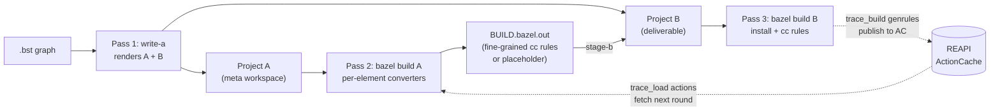
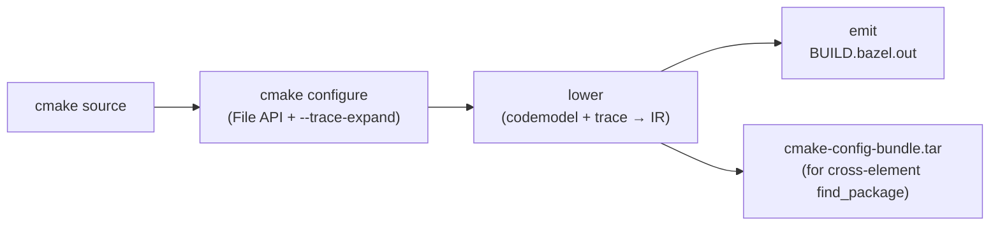
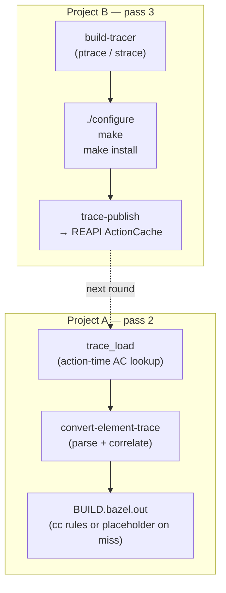
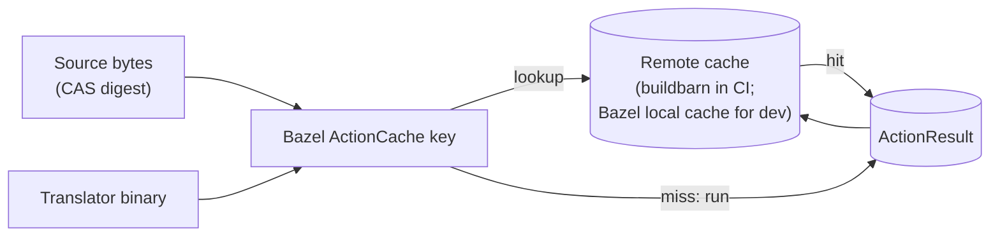

# Architecture

For what's shipped vs queued, see [`ROADMAP.md`](../ROADMAP.md). For
deep-dive design specs of individual mechanisms, see [`docs/design/`](design/).
For a developer-facing tour of the repo packages, see
[`codebase-map.md`](codebase-map.md).

## The problem in one paragraph

[BuildStream](https://www.buildstream.build/) drives the FreeDesktop
SDK (and projects of its shape) by running each element's build in a
sandbox via the `bst` runtime, with dependencies flowing through
opaque install-tree archives and the graph encoded as YAML (one
`.bst` per element). The goal here is the same artifacts under
[Bazel](https://bazel.build/), with native `cc_library` / `cc_binary`
rules — so Bazel's incremental build, remote execution, and remote
cache see the project at fine grain. This tool is a one-way
transition: convert once, commit the generated workspace, and the
downstream team owns plain Bazel from then on.

## Two workspaces, three passes



`cmd/write-a` (pass 1) parses the `.bst` graph and emits both
workspaces' `MODULE.bazel` + per-element `BUILD.bazel` files. It
never invokes Bazel or runs any builds itself.

**Project A** is the meta workspace. One `BUILD.bazel` per element,
each a `genrule` that invokes the per-kind translator
(`convert-element-cmake`, `convert-element-trace`,
`convert-element-meson`, `convert-element-pyproject`) on the
element's source tree. The genrule's output is a `BUILD.bazel.out`
holding the native cc rules, plus kind-specific side channels (cmake
config bundles, install-tree tarballs). Project A is scaffolding —
discarded after conversion converges.

**Project B** is the deliverable. Each element's `BUILD.bazel` is
staged from project A's `BUILD.bazel.out` via `cmd/stage-b`. Once
staged, `bazel build //...` over project B compiles the project with
native cc rules — no BuildStream / `bst` at runtime. After
convergence, `cmd/finalize-b` strips the conversion-time scaffolding
(see [`design/finalize-b.md`](design/finalize-b.md)) and the result
is a standalone Bazel project.

The three passes:

| Pass | What runs | Cost |
|---|---|---|
| 1: `write-a` | `.bst` graph → A + B BUILD files | seconds; always re-runs |
| 2: `bazel build A` | per-element converter genrules | cheap for introspection-based kinds (cmake, meson); placeholder on AC miss for trace-driven kinds |
| 3: `bazel build B` | cc compile/link + `trace_build` genrules for trace-driven kinds | cheap for cc rules; expensive for first-round `trace_build` (configure + make + install + trace) |

For kinds that introspect their build graph from sources alone
(`kind:cmake`, `kind:meson`), pass 2 produces fine-grained cc rules
in one shot. For kinds where the build graph is only knowable by
running the build (`kind:autotools`, `kind:make`, `kind:makemaker`,
`kind:modulebuild`, `kind:manual`, `kind:script`), pass 2 needs a
*trace* from a previous pass 3 — see "The rendezvous" below.

## Per-kind conversion paths

### `kind:cmake` — File API driven (single pass)



cmake's File API gives us codemodel-v2 (targets, sources, link
fragments), toolchains-v1 (compiler ID, flags), and cmakeFiles-v1
(read paths). `--trace-expand` adds PUBLIC/PRIVATE keyword arms,
`target_link_libraries`, `configure_file` calls. The converter folds
both into an IR (`converter/internal/ir`) and emits native `cc_library`
/ `cc_binary`. Known gaps:
[`cmake-conversion-deltas.md`](cmake-conversion-deltas.md) (cmake →
converter) and [`fidelity-deltas.md`](fidelity-deltas.md) (artifact
diffs).

### Trace-driven kinds — coarse-then-fine via REAPI ActionCache

`kind:autotools` / `kind:make` / `kind:makemaker` / `kind:modulebuild`
/ `kind:manual` / `kind:script` have no introspection equivalent.
The only way to recover the build graph is to run `make` and trace
`execve` calls. Round-2 splits the work between project A and project
B; the AC bridges them.



- **Pass 2** runs a `trace_load(...)` action (in-tree rule, source in
  `rules_buildstream_bazel/rules/traces.bzl`) that queries the REAPI
  ActionCache via `cmd/trace-lookup`. On hit, the converter genrule
  consumes the trace and emits fine-grained cc rules. On miss, it
  emits a placeholder.
- **Pass 3** runs a `<elem>_trace_build` genrule (tagged
  `trace_build`) that wraps `./configure && make && make install`
  under `cmd/build-tracer`, then calls `cmd/trace-publish` to write
  the trace under `SyntheticActionDigest(srckey, platform)` in the
  ActionCache. Next round's pass 2 hits.

The fixpoint loop is `tools/converge.sh` (see
[`design/convergence-driver.md`](design/convergence-driver.md)); the
mechanism details are in
[`design/rendezvous.md`](design/rendezvous.md). For a `--trace-round1`
legacy shape where the converter runs inline in project B, see the
write-a flag; round-2 is the default.

### Pipeline kinds without trace opt-in

`kind:make` / `kind:manual` / `kind:script` / `kind:makemaker` /
`kind:modulebuild` without the trace-driven config render as a single
`pipeline_install` (`rules_buildstream_bazel/rules/install.bzl`) that
installs into a `declare_directory` install-root TreeArtifact (no
`install_tree.tar`). Consumers reference the directory in place via
the rule's `deps` attr / `pick_file` (no untar).

### Composition kinds (`stack` / `filter` / `compose` / `import`)

No genrule. `BUILD.bazel` is pure starlark filegroup composition over
deps' install trees.

### `kind:bazel` — passthrough

Source ships its own BUILD files; write-a stages the tree verbatim
into project B. No genrule, no introspection. Used for upstream
Bazel-native sources or hand-edited forks of converter output.

## Cross-element data flow

`kind:cmake` consumers need build-config metadata for their deps at
pass-2 time. Two mechanisms handle that.

**cmake → cmake**: the producer's `convert-element-cmake` synthesizes
a cmake-config bundle (`PkgConfig.cmake` + `PkgTargets.cmake` plus
zero-byte stubs at every `IMPORTED_LOCATION` path) from the
codemodel alone — no build of the producer is required, only its
graph introspection. The consumer's genrule extracts the bundle into
a shared `$PREFIX`; `find_package(Pkg CONFIG)` resolves against the
staged tree. The actual Bazel dep edge in the consumer's
`BUILD.bazel.out` comes from `imports.json`, the per-element imports
manifest (`internal/manifest`).

**cmake → non-cmake**: the metadata only exists after the dep's
pass-3 install build. The driver loop bridges this via the same AC
rendezvous as trace-driven kinds, with a second keyspace
(`SyntheticConfigDigest`) for the config bundle. See
[`design/rendezvous.md`](design/rendezvous.md).

**autotools → anything**: cross-element resolution uses `imports.json`
to map `-l<name>` link flags to `//elements/<name>:<name>` Bazel
labels via `manifest.LookupLinkLibrary`.

## Edit scenarios

| Edit | Cost |
|---|---|
| `.c` / `.cpp` content edit (any kind) | recompile just the changed TU |
| `CMakeLists.txt` edit | pass-2 cache miss → re-convert → recompile affected cc rules |
| `configure.ac` / `Makefile.in` / `*.am` / `*.h` (trace-driven) | srckey changes → full trace_build re-runs (full autotools build, one-time per srckey) |
| Dep content change | downstream's pass-3 actions re-run incrementally |

Per-kind narrowing patterns
(`cmd/write-a/<kind>SrckeyPatterns()`) exclude content of files that
don't change the graph (e.g. `.c` / `.cpp` for trace-driven kinds)
from the srckey. So a comment-only `.c` edit in an autotools element
stays on the cheap path: trace_load hits the AC, the converter emits
the same cc rules, and pass 3 incrementally rebuilds just the
changed translation unit.

The full autotools build is a one-time cost per srckey. After that,
graph-irrelevant edits stay on the cheap path until a graph-affecting
edit invalidates the srckey.

## Generated workspace shape (interop contract)

A sibling tool (or any consumer of the generated workspace) sees a
stable label namespace:

| Label | Meaning |
|---|---|
| `//elements/<name>:<name>` | Primary cc rule for `kind:cmake` / native `kind:autotools` |
| `//elements/<name>:<name>_install` | `pipeline_install` (project B); outputs the install-root TreeArtifact directory, plus `trace.log` / `make-db.txt` (extra_outs) for trace-driven kinds |
| `//elements/<name>:<name>_build` | Round-2 converter genrule (project A, trace-driven kinds) |
| `//elements/<name>:<name>_converted` | cmake converter genrule (project A); outputs `BUILD.bazel.out` + `cmake-config-bundle.tar` |
| `//elements/<name>:cmake_config_bundle` | Synthesized cmake-config bundle tar for cross-element `find_package` |
| `//elements/<name>:build_bazel` | Filegroup over `BUILD.bazel.out` |

Project A layout:

```
project-A/
├── MODULE.bazel
├── BUILD.bazel
├── rules/                       # in-repo rules (zero_files, sources, traces)
├── tools/                       # convert-element-* / build-tracer / trace-lookup / trace-publish
└── elements/<name>/
    ├── BUILD.bazel              # genrule invoking the per-kind converter
    ├── sources/ or @src_<key>// # source tree (staged or CAS-served)
    └── imports.json             # cross-element label map (when deps present)
```

Project B layout:

```
project-B/
├── MODULE.bazel
├── BUILD.bazel
└── elements/<name>/
    ├── BUILD.bazel              # initially a placeholder; stage-b overwrites with project A's BUILD.bazel.out
    └── ...source files
```

Per-element BUILD shape evolves through three stages during
conversion (pre-build → converged-with-debris → standalone after
`finalize-b`). The three shapes and the strip pass are documented in
[`design/conversion-architecture.md`](design/conversion-architecture.md)
and [`design/finalize-b.md`](design/finalize-b.md).

## Caching and convergence



For `kind:cmake` / `kind:meson` there is no separate srckey registry
— Bazel's ActionCache **is** the convergence point. Same source +
same toolchain + same converter version → same action key → same
outputs, shared across all builders.

For trace-driven kinds, the REAPI ActionCache doubles as a srckey →
trace registry. `cmd/trace-publish` writes `(srckey → trace)` under
`SyntheticActionDigest(srckey, platform)`; `cmd/trace-lookup` reads
it back at action time. No separate registry service — one endpoint,
two uses.

## Build-without-the-bytes (`bb_clientd`)

With Bazel 9 + `bb_clientd` + `--experimental_remote_output_service=`,
source bytes never land on the developer's disk: actions stream them
through a FUSE mount, Bazel trusts daemon-reported digests, and
build outputs are also materialised lazily. See
[`design/sources.md`](design/sources.md).

Without it, sources are staged into `elements/<name>/sources/` on
disk (the default dev path).

## Where to read deeper

| Topic | Doc |
|---|---|
| End-state architecture (BUILD evolution, rules patterns) | [`design/conversion-architecture.md`](design/conversion-architecture.md) |
| 8-slide presentation | [`design/conversion-architecture-slides.md`](design/conversion-architecture-slides.md) |
| AC rendezvous wire format | [`design/rendezvous.md`](design/rendezvous.md) |
| Fixpoint driver loop | [`design/convergence-driver.md`](design/convergence-driver.md) |
| Deliverable strip pass | [`design/finalize-b.md`](design/finalize-b.md) |
| Narrowing-audit recipe | [`design/narrowing-audit.md`](design/narrowing-audit.md) |
| BwoB / source mount | [`design/sources.md`](design/sources.md) |
| FDSDK kind coverage | [`fdsdk-coverage.md`](fdsdk-coverage.md) |
| Multi-version cmake compatibility matrix | [`cmake-version-matrix.md`](cmake-version-matrix.md) |
| Known conversion gaps (cmake → converter) | [`cmake-conversion-deltas.md`](cmake-conversion-deltas.md) |
| Known fidelity gaps (cmake-built vs Bazel-built) | [`fidelity-deltas.md`](fidelity-deltas.md) |
| Failure-code taxonomy | [`failure-schema.md`](failure-schema.md) |
| Codegen tag taxonomy | [`codegen-tags.md`](codegen-tags.md) |
| Repo package tour | [`codebase-map.md`](codebase-map.md) |
| Dev-loop commands + test map | [`../CONTRIBUTING.md`](../CONTRIBUTING.md) |
