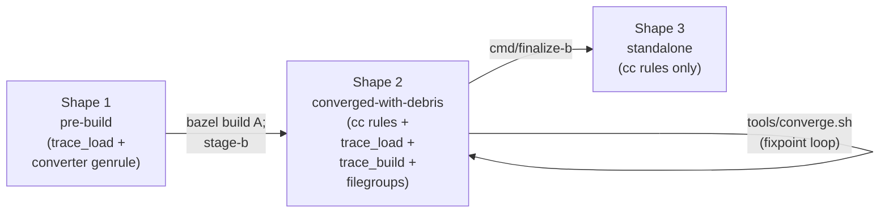

# Conversion architecture — end state and rule patterns

The two-project shape, three passes, and rendezvous overview are in
[`../architecture.md`](../architecture.md). The AC wire format and
keyspaces are in [`rendezvous.md`](rendezvous.md). The fixpoint loop
is in [`convergence-driver.md`](convergence-driver.md). The
deliverable strip pass is in [`finalize-b.md`](finalize-b.md). The
8-slide presentation is in
[`conversion-architecture-slides.md`](conversion-architecture-slides.md).

This doc covers what's left: the four starlark primitives the
rendered workspaces depend on, and how a per-element `BUILD.bazel`
evolves from pre-build through converged-with-debris to the
standalone deliverable shape.

## `rules_buildstream_bazel/`

The rendezvous machinery is implemented as starlark primitives in
`rules_buildstream_bazel/`, an in-repo Bazel module that both project
A and project B reference via
`bazel_dep(name = "rules_buildstream_bazel")` +
`local_path_override(path = "...")`. The module is **not published
to BCR** — it's tightly coupled to write-a's emit shape; "same
commit for write-a and the rules package" is the version-locking
story. `finalize-b` removes the `bazel_dep` + `local_path_override`
when the converted deliverable no longer references the package
(typically when every element has fine cc rules and no `trace_load`
/ `trace_build` survives).

### `trace_load` rule — `rules/traces.bzl`

Action-time consumer of the round-2 AC rendezvous. One target per
round-2-using element. The action shells out to the consuming
project's `//tools:trace-lookup` binary, which performs the
`GetActionResult(SyntheticActionDigest(srckey, platform))` lookup
and materializes outputs.

```python
load("@rules_buildstream_bazel//rules:traces.bzl", "trace_load")

trace_load(
    name = "greet_trace_load",
    srckey = "abc...def",             # mandatory; hex per-element narrowed digest
    platform = "x86_64-linux",        # optional; partitions the keyspace per-platform
    expect_make_db = True,            # trace-driven kinds; False for cmake/meson round-2 fallback
    expect_config_bundle = True,      # opts in to the SyntheticConfigDigest leg
    trace_lookup = "//tools:trace-lookup",  # mandatory; resolves in caller's repo
)
```

Outputs land under `<name>/`:

- `<name>/trace.log` — zero-byte on miss, real bytes on hit.
- `<name>/marker` — `"hit\n"` or `"miss\n"`; the convergence driver
  reads these to find the frontier.
- `<name>/make-db.txt` (only when `expect_make_db = True`).
- `<name>/cmake-config-bundle.tar` (only when
  `expect_config_bundle = True`) — bundle hit/miss is independent of
  trace hit/miss; zero-byte on bundle miss.

Action env: `use_default_shell_env = True` opts the action into
seeing `--action_env` values. `trace-lookup` reads `CAS_GRPC_ADDR`
from there. The convergence driver bumps
`--action_env=CONVERGE_GENERATION=<n>` between rounds — Bazel's
ActionCache tracks `--action_env` values, so a bump invalidates the
cached output and forces a fresh `GetActionResult`.

**Why `trace_lookup` is a mandatory attr.** A label-attr default
inside the rules package would resolve to
`@rules_buildstream_bazel//tools:trace-lookup` at definition time,
but the binary lives in each consuming project's `//tools/`. Making
`trace_lookup` public + mandatory lets the caller's label resolve in
the caller's repo. Trade-off: if the binary ever relocates (`tools/`
→ `_tools/`), every call site needs updating in lockstep — acceptable
given the four-call surface.

**Queryability.** The starlark rule kind is `trace_load` (lowercase)
— `bazel cquery 'kind("trace_load", //...)'` enumerates the targets.
The action mnemonic is `TraceLoad` (set by `ctx.actions.run(mnemonic
= "TraceLoad", ...)`) — appears as the `mnemonic` field in
execution-log JSON and matches
`bazel aquery 'mnemonic("TraceLoad", //...)'`. Two distinct
namespaces; don't mix them.

### `trace_build` (tagged genrule — convention, not a rule)

The producer side is a regular `genrule` that runs configure / make
/ make-install (or the kind-equivalent) under `build-tracer`, then
calls `trace-publish`. The convention is `name =
"<elem>_trace_build"` plus `tags = ["trace_build"]` so the
convergence driver can find the set:

```python
genrule(
    name = "greet_trace_build",
    srcs = [...],
    outs = ["install_tree.tar", ...],
    cmd = "build-tracer ... configure && make && make install && trace-publish ...",
    tags = ["trace_build"],
)
```

The convergence driver queries via
`bazel query 'attr(tags, "^trace_build$", //...)'` (anchored to
avoid matching future `trace_build_v2`-style tags). Each matched
target is one publish site; the driver builds the frontier subset
whose corresponding `trace_load` returned miss.

Why a tagged genrule, not a custom rule: keeps the publish-side
flexibility kind-handlers need (each kind's install-genrule template
renders slightly different `cmd` content — autotools' configure
invocation, meson's `meson setup`, etc.) while exposing a uniform
query surface to the driver. The trade-off is that "is this a
trace_build" is a name + tag convention rather than a type
signature — write-a owns enforcement at emit time.

### `zero_files` rule — `rules/zero_files.bzl`

Materializes zero-length stub files at declared package-relative
paths. Used by project A's per-element shadow trees: a
`convert-element-cmake` action's `srcs` is the union of real source
files plus zero-stubs for paths cmake's `file(GLOB)` walks would
naturally see but cmake configure doesn't actually open.

```python
load("@rules_buildstream_bazel//rules:zero_files.bzl", "zero_files")

zero_files(
    name = "greet_zero_stubs",
    paths = [
        "src/excluded_file.c",
        "tests/golden.txt",
        # ...
    ],
)
```

Two reasons this primitive exists:

1. **CMake glob shape.** `file(GLOB)` records directory entries
   during configure. Hiding paths cmake's globs would walk would
   shift the generated graph. Zero stubs preserve the shape; cmake
   sees the entry, can't read content, but content was never relevant
   for a pure walk.
2. **Cache-key stability.** A `convert-element-cmake` action's input
   merkle includes the content of every `srcs` entry. Stubbing files
   cmake never opens means edits to those files' real content don't
   reshape the action key — cache hits across
   semantically-irrelevant edits.

The stubbed-path set is determined per-element by inverting the
converter's `read_paths.json` against the element's source glob.
write-a renders the resulting list into the per-element `BUILD.bazel`.

### `sources` module extension — `rules/sources.bzl`

Declares one external repo per source identity in the `.bst` graph
(read from `tools/sources.json` via a `from_json` tag class). Each
repo's `:tree` filegroup `ctx.symlink`s into the CAS-FUSE mount
(`bb_clientd`) so source bytes live in CAS but resolve as on-disk
paths from Bazel's perspective. See [`sources.md`](sources.md) for
the full design.

## Per-element BUILD evolution

The same element's per-element `BUILD.bazel` goes through three
shapes during conversion. Concrete example: a kind:autotools element
`greet`.

### Shape 1 — pre-build (rendered by `write-a`, before any build)

Project A's `elements/greet/BUILD.bazel`:

```python
load("@rules_buildstream_bazel//rules:traces.bzl", "trace_load")

trace_load(
    name = "greet_trace_load",
    srckey = "abc...def",
    trace_lookup = "//tools:trace-lookup",
    expect_config_bundle = True,
)

genrule(
    name = "greet_converted",
    srcs = [":greet_trace_load", ":sources", ...],
    outs = ["BUILD.bazel.out"],
    cmd = "convert-element-trace ...",
)
```

Project B's `elements/greet/BUILD.bazel` (the stage-b target,
overwritten each round):

```python
# Placeholder — overwritten by stage-b after pass 2.
exports_files(["BUILD.bazel.out"])
```

### Shape 2 — converged-with-debris (post-fixpoint, before finalize-b)

Project B's `elements/greet/BUILD.bazel` after enough rounds for the
trace to land and the converter to emit real cc rules:

```python
load("@rules_buildstream_bazel//rules:traces.bzl", "trace_load")

trace_load(
    name = "greet_trace_load",
    srckey = "abc...def",
    trace_lookup = "//tools:trace-lookup",
    expect_config_bundle = True,
)

genrule(
    name = "greet_trace_build",
    srcs = [":sources", ...],
    outs = ["install_tree.tar", ...],
    cmd = "configure && make && make install && trace-publish ...",
    tags = ["trace_build"],
)

filegroup(name = "install_tree.tar", srcs = [":greet_trace_build"])

cc_library(
    name = "greet",
    srcs = [...],
    hdrs = [...],
    deps = [...],
)

cc_binary(
    name = "greet-bin",
    srcs = ["main.c"],
    deps = [":greet"],
)
```

Both the cc rules (the real artifact) AND the trace_load /
trace_build scaffolding (no longer load-bearing for *this* element,
but consumed by other elements during convergence) coexist.

### Shape 3 — standalone (after `finalize-b`)

`finalize-b --in $B --out $B_FINAL` walks every BUILD; for elements
with fine cc rules (`cc_library` / `cc_binary` / `cc_import` /
`cc_test` present and not tagged with a `*-codegen-target-fallback`
marker) it strips:

- `trace_load(...)` targets.
- `genrule(... tags = ["trace_build"])` targets.
- Conversion-era intermediate filegroups (`:install_tree.tar`,
  `:cmake_config_bundle`, `:pkg_config_bundle`, `:build_bazel`).
- `load()` statements whose imported names are no longer referenced.

After per-element cleanup it walks `MODULE.bazel` for any remaining
`@rules_buildstream_bazel//` reference. When none survives, it
removes the `bazel_dep` + `local_path_override`.

The result:

```python
cc_library(
    name = "greet",
    srcs = [...],
    hdrs = [...],
    deps = [...],
)

cc_binary(
    name = "greet-bin",
    srcs = ["main.c"],
    deps = [":greet"],
)
```

And a `MODULE.bazel` with no `rules_buildstream_bazel` reference.
This is the deliverable: a pure Bazel project the downstream team
owns going forward, with no conversion-time machinery left to
maintain.



Conservative-detection: elements without fine cc rules are left
alone (no decisions to make — `finalize-b` is a no-op for them).
Elements with cc rules tagged as Phase B fallbacks
(`cmake-codegen-target-fallback` / `meson-codegen-target-fallback`)
are also left alone — those `cc_import` stubs reference paths the
`install_tree.tar` produces, so the scaffolding is still
load-bearing. `finalize-b` is **idempotent** (re-running on a
finalized project produces byte-identical output) and
**non-destructive** (`--in` never modified; `--out` refuses to
overwrite an existing path).

## End state

After the loop reaches fixpoint and `finalize-b` runs:

- **Project B's standalone form is the deliverable.** Check it into
  a downstream repo; the team owns plain Bazel from there.
- **Project A is conversion scaffolding.** It can be discarded,
  re-rendered from `.bst` on demand, or kept as a regeneration
  artifact. It plays no role in the deliverable.
- **The REAPI rendezvous cache is a converter-side accelerator.**
  Project B's `bazel build //...` works against any REAPI cache or
  none at all; the synthetic-key entries are read only by project A's
  converters during conversion.

The "transition tool, success = you don't need it anymore" framing
from `ROADMAP.md` lands cleanly: the *thing* the conversion yields
is a literal artifact (finalized project B), not "the converged
state of project B." A is conversion scaffolding that exists to
produce the final B and can be discarded thereafter.
