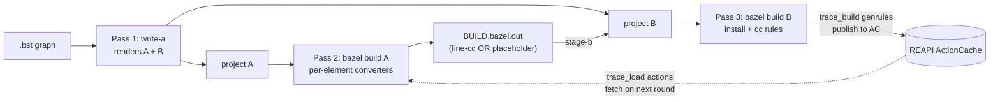
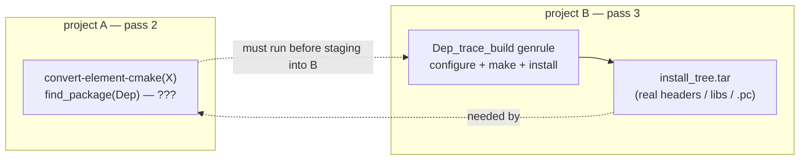
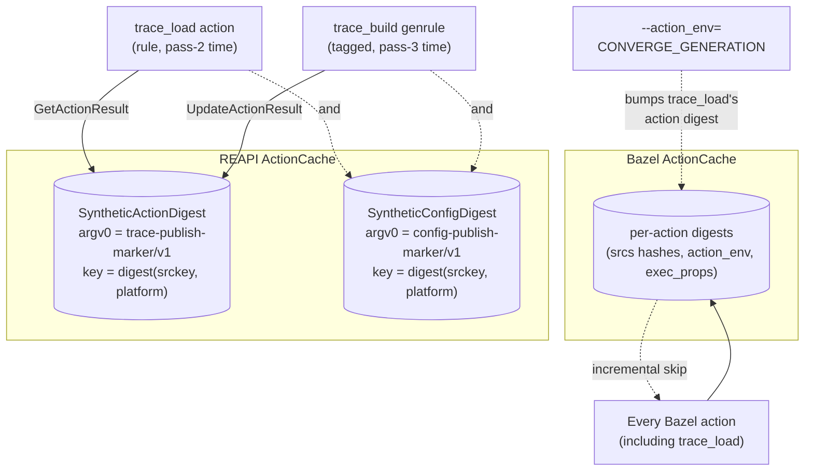
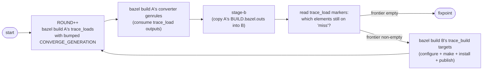
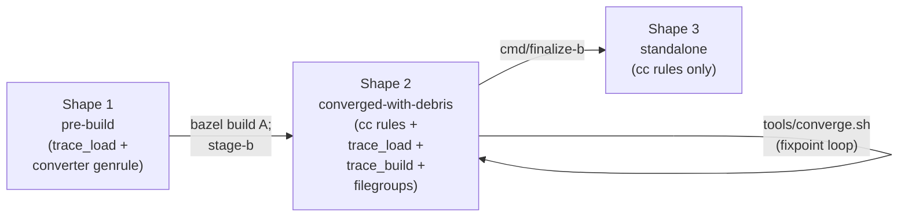

# Conversion architecture — end state

This is the single end-state architecture doc for the
BuildStream-to-Bazel conversion stack. It describes the
shape that lives in `main` today, after the cross-element
configure-step bootstrap (ROADMAP item, six PRs) landed: an
action-time `trace_load` rule + `trace_build` genrule pair
talking through the REAPI ActionCache, a fixpoint driver
loop, and a `finalize-b` post-pass that strips conversion-time
scaffolding from the deliverable.

For *what's in this repo* — files, binaries, packages — see
[`architecture.md`](../architecture.md). This doc is the
*how it all hangs together* layer: pass structure, the
two-project boundary, the rendezvous channel between passes,
and the BUILD evolution from converted-with-debris through
`finalize-b` to standalone Bazel.

For per-kind dispatch details see the individual handler docs
under `docs/design/`. For the focused mechanism specs see
[`autotools-round2-rendezvous.md`](autotools-round2-rendezvous.md)
(synthetic key + publish/lookup wire),
[`cross-element-config-rendezvous.md`](cross-element-config-rendezvous.md)
(the config-bundle keyspace),
[`convergence-driver.md`](convergence-driver.md) (`tools/converge.sh`),
and [`finalize-b.md`](finalize-b.md).

## The two projects

The conversion produces **two Bazel workspaces**, project A and
project B. They are independent bzlmod modules; nothing in
Bazel's analysis graph connects them.

| | Project A | Project B |
|---|---|---|
| **Purpose** | Conversion-time meta-workspace | The deliverable |
| **Per-element BUILD** | One genrule per element invoking a per-kind converter (`convert-element-cmake`, `convert-element-trace`, …) | Either fine-grained `cc_library` / `cc_binary` (the converged shape) or coarse `genrule` shapes for unconverted elements |
| **Lifespan** | Discarded after the conversion converges | Checked in / handed off as the standalone Bazel project |
| **REAPI dependence** | Heavy (converter genrules read AC entries published from B's trace_build actions) | None (B's final cc rules are pure Bazel; `bazel build //...` over B works with no rendezvous cache at all) |

`cmd/write-a` is the static renderer. It parses the `.bst`
graph and emits both workspaces' `MODULE.bazel` /
per-element `BUILD.bazel` / filegroup / config_setting
plumbing in one go. `cmd/stage-b` is the in-loop staging step
that copies A's `BUILD.bazel.out`s over B's per-element
BUILDs once the converter genrules have run.

## The three passes



| Pass | What runs | Cost |
|---|---|---|
| 1: `write-a` | `.bst` graph → A + B BUILD files | seconds; always re-runs |
| 2: `bazel build A` | Per-element converter genrules | cheap for kinds with structured introspection (cmake's File API, meson's introspection); placeholder-shaped on AC miss for trace-driven kinds |
| 3: `bazel build B` | Per-element install + cc rules; `trace_build` genrules run configure + make + install + publish for trace-driven kinds | expensive for trace_build actions on first round; cheap for cc-rule compiles on every subsequent round |

For element kinds that introspect their build graph from
sources alone (`kind:cmake`, `kind:meson`), pass 2 emits
fine-grained BUILD definitions in one shot. For kinds where
the build graph is only knowable by actually running the build
(`kind:autotools`, `kind:make`, `kind:makemaker`,
`kind:modulebuild`, `kind:manual`, `kind:script`), pass 2 needs
a *trace* from a previous pass 3 — which is what the rendezvous
channel transports.

## Why the rendezvous: the cross-workspace edge problem

A `kind:cmake` element X with `find_package(Dep CONFIG)`
against a `kind:autotools` dep needs **build-config metadata for
Dep** at *X's pass-2 time* — but for a trace-based Dep that
metadata only exists after Dep's *pass-3 install build*. The
ordering hazard:



This is **not a per-element cycle** — Dep's `install_tree.tar`
doesn't depend on X — but it **is** a pass-ordering inversion.
And it can't be expressed as a Bazel edge because:

- Projects A and B are independent bzlmod modules. A literal
  label edge across them requires either merging them (large
  structural change that blurs the deliverable contract) or a
  repository rule in A that shells `bazel build` into B at
  load time.
- The repo-rule variant doesn't run on RBE and does
  loading-time work that blocks Bazel startup.
- It permanently couples B to A. B is supposed to be the
  *deliverable* — a standalone Bazel project after the
  conversion converges. A structural A↔B Bazel edge means B can
  never be detached.

The rendezvous channel **is** the A-on-B-output dependency —
expressed *indirectly* through the action cache rather than as
a Bazel label edge. That indirection is the point: it keeps
the two workspaces independently buildable, survives remote
execution, and leaves no trace in B's final graph.

## The rendezvous channel — two cache layers, separate jobs



Two cache layers run in parallel; each catches a different
class of "did this need to re-run".

### Layer 1 — Bazel's own ActionCache

Every Bazel action keys against `(srcs digests, action_env,
exec_props, …)`. Sufficient for everything *inside* one project
build: incremental cc compiles, the converter genrule re-running
when a `.bst` source changes, `bazel build` skipping unchanged
work. The `trace_load` action is also a normal Bazel action and
participates here — once its `srckey` + `platform` + `--action_env=CONVERGE_GENERATION`
inputs haven't changed, Bazel skips it.

### Layer 2 — REAPI ActionCache via synthetic keys

The synthetic-key channel transports outputs from one workspace's
pass-3 to the other workspace's pass-2 *without* needing a Bazel
edge between them. Two distinct keyspace partitions, both keyed
off `(srckey, platform)`:

- **`SyntheticActionDigest`** (argv0 marker
  `cmake-to-bazel/trace-publish-marker/v1`): the trace + make-db
  for trace-driven kinds. Pass-3's `trace_build` publishes;
  pass-2's `trace_load` materializes.
- **`SyntheticConfigDigest`** (argv0 marker
  `cmake-to-bazel/config-publish-marker/v1`): a cmake-config
  bundle (`.pc` files + `lib/cmake/<Pkg>/` directories from the
  real install tree). Same publisher and consumer actions;
  distinct AC key so trace and bundle don't collide.

The synthetic Action proto is never executed — only its digest
is used as a key/value lookup index. Implementation lives in
`internal/tracenorm/synthkey.go`; recipe is
`(argv0 marker, srckey hex, platform) → digest(Action proto)`.

### Why bump `CONVERGE_GENERATION` between rounds

`trace_load` is a Bazel action — Bazel caches its output. But
the AC view (what the REAPI store holds) can shift between
rounds *without any input file changing*: the previous round
just published the dep's trace. The `CONVERGE_GENERATION`
`--action_env` value is the side-channel signal "the AC view
has likely changed; please re-query." Bazel's ActionCache
tracks `--action_env` as inputs, so bumping
`CONVERGE_GENERATION` invalidates every trace_load's cached
output and forces a fresh `GetActionResult`. The driver owns
the bumping.

## The driver loop — `tools/converge.sh`



Each round:

1. `bazel build` project A's `:*_trace_load` targets with
   `--action_env=CONVERGE_GENERATION=$ROUND` — forces AC re-query.
2. `bazel build` project A's converter genrules — they consume
   the newly materialized trace_load outputs (or the empty
   placeholders if the AC missed).
3. `cmd/stage-b` copies A's `BUILD.bazel.out` files into B.
4. Read the trace_load markers (`hit\n` or `miss\n`) to find the
   frontier — elements whose lookup returned miss.
5. For each frontier element, `bazel build` the matching
   `:*_trace_build` target in project B. The action runs
   configure / build / install / publish; the publish step lands
   the trace + config bundle in CAS.
6. Goto 1.

**Termination** is when the frontier is empty. Guaranteed to be
reached in bounded rounds: the `.bst` graph is a DAG, and each
round resolves at least one frontier element. Worst case is the
longest configure-needing chain (a cmake → trace → cmake → trace
alternation); in practice depth ≤ 2 is the common case for
FDSDK-shaped projects.

**Offline mode**: `CAS_GRPC_ADDR` empty makes `trace-publish` /
`trace-lookup` no-ops. The loop still runs; the per-element
BUILD shapes are correct (placeholder for refused / non-converted
elements; coarse install genrules built for every other element).
Termination is via `--max-rounds` with a clear diagnostic.
Equivalent to today's `bazel build A; stage-b; bazel build B`
flow expressed through the driver.

## The rule patterns — `rules_buildstream_bazel/`

The rendezvous machinery is implemented as four starlark
primitives in `rules_buildstream_bazel/`, an in-repo Bazel
module that both project A and project B reference via
`bazel_dep(name = "rules_buildstream_bazel")` +
`local_path_override(path = "...")`. The module is **not
published to BCR** — it's tightly coupled to write-a's emit
shape; "same commit for write-a and the rules package" is the
version-locking story. `finalize-b` removes the `bazel_dep` +
`local_path_override` when the converted deliverable no longer
references the package (typically when every element has fine
cc rules and no `trace_load` / `trace_build` survives).

### `trace_load` (rule) — `rules/traces.bzl`

Action-time consumer of the round-2 AC rendezvous. One target
per round-2-using element. The action shells out to the
consuming project's `//tools:trace-lookup` binary, which
performs the `GetActionResult(SyntheticActionDigest(srckey,
platform))` lookup and materializes outputs.

```python
load("@rules_buildstream_bazel//rules:traces.bzl", "trace_load")

trace_load(
    name = "greet_trace_load",
    srckey = "abc...def",             # mandatory; hex per-element narrowed digest
    platform = "x86_64-linux",        # optional; partitions the keyspace per-platform
    expect_make_db = True,            # trace-driven kinds; False for cmake/meson round-2 fallback
    expect_config_bundle = True,      # opts in to the SyntheticConfigDigest leg
    trace_lookup = "//tools:trace-lookup",  # mandatory; resolves in caller's repo
)
```

Outputs land under `<name>/`:

- `<name>/trace.log` — zero-byte on miss, real bytes on hit.
- `<name>/marker` — `"hit\n"` or `"miss\n"`; the convergence
  driver reads these to find the frontier.
- `<name>/make-db.txt` (only when `expect_make_db = True`).
- `<name>/cmake-config-bundle.tar` (only when
  `expect_config_bundle = True`) — bundle hit/miss is
  independent of trace hit/miss; zero-byte on bundle miss.

Action env: `use_default_shell_env = True` opts the action
into seeing `--action_env` values. `trace-lookup` reads
`CAS_GRPC_ADDR` from there. The convergence driver bumps
`--action_env=CONVERGE_GENERATION=<n>` between rounds — Bazel's
ActionCache tracks `--action_env` values, so a bump invalidates
the cached output and forces a fresh `GetActionResult`.

**Why `trace_lookup` is a mandatory attr, not a rule default.**
A label-attr default *inside* the rules package would resolve
to `@rules_buildstream_bazel//tools:trace-lookup` at definition
time, but the binary lives in each consuming project's
`//tools/`. Making `trace_lookup` public + mandatory lets the
caller's label resolve in the caller's repo. Every rendered
`trace_load(...)` passes `trace_lookup = "//tools:trace-lookup"`
explicitly. Trade-off: if the binary ever relocates (`tools/`
→ `_tools/`), every call site needs updating in lockstep —
acceptable given the four-call surface.

**Queryability.** The starlark rule kind is `trace_load`
(lowercase) — `bazel cquery 'kind("trace_load", //...)'`
enumerates the targets. The action mnemonic is `TraceLoad`
(set by `ctx.actions.run(mnemonic = "TraceLoad", ...)`) — it
appears as the `mnemonic` field in execution-log JSON (which
the `e2e-meta-trace-driven-re.sh` gate greps for) and matches
`bazel aquery 'mnemonic("TraceLoad", //...)'`. Two distinct
namespaces; don't mix them.

### `trace_build` (tagged genrule) — convention, not a rule

The producer side is a regular `genrule` that runs configure /
make / make-install (or the kind-equivalent) under
`build-tracer`, then calls `trace-publish`. The convention is
`name = "<elem>_trace_build"` plus `tags = ["trace_build"]` so
the convergence driver can find the set:

```python
genrule(
    name = "greet_trace_build",
    srcs = [...],
    outs = ["install_tree.tar", ...],
    cmd = "build-tracer ... configure && make && make install && trace-publish ...",
    tags = ["trace_build"],
)
```

The convergence driver queries via
`bazel query 'attr(tags, "^trace_build$", //...)'` (anchored
to avoid matching future `trace_build_v2`-style tags). Each
matched target is one publish site; the driver builds the
frontier subset whose corresponding `trace_load` returned miss.

Why a tagged genrule, not a custom rule: keeps the publish-side
flexibility kind-handlers need (each kind's install-genrule
template renders slightly different `cmd` content — autotools'
configure invocation, meson's `meson setup`, etc.) while
exposing a uniform query surface to the driver. The trade-off
is that "is this a trace_build" is a name + tag convention
rather than a type signature — write-a owns enforcement at
emit time.

### `zero_files` (rule) — `rules/zero_files.bzl`

Materializes zero-length stub files at declared
package-relative paths. Used by project A's per-element shadow
trees: a `convert-element-cmake` action's `srcs` is the union
of real source files plus zero-stubs for paths cmake's
`file(GLOB)` walks would naturally see but cmake configure
doesn't actually open.

```python
load("@rules_buildstream_bazel//rules:zero_files.bzl", "zero_files")

zero_files(
    name = "greet_zero_stubs",
    paths = [
        "src/excluded_file.c",
        "tests/golden.txt",
        # ...
    ],
)
```

Two reasons this primitive exists:

1. **CMake glob shape.** `file(GLOB)` records directory entries
   during configure. Hiding paths cmake's globs would walk
   would shift the generated graph — a glob that was supposed
   to match N files matches fewer. Zero stubs preserve the
   shape; cmake sees the entry, can't read content, but content
   was never relevant for a pure walk.
2. **Cache-key stability.** A `convert-element-cmake` action's
   input merkle includes the content of every `srcs` entry.
   Stubbing files cmake never opens means edits to those files'
   real content don't reshape the action key — cache hits
   across semantically-irrelevant edits.

The stubbed-path set is determined per-element by inverting
the converter's `read_paths.json` against the element's source
glob. write-a renders the resulting list into the per-element
`BUILD.bazel`.

### `sources` (module extension) — `rules/sources.bzl`

Declares one external repo per source identity in the `.bst`
graph (read from `tools/sources.json` via a `from_json` tag
class). Each repo's `:tree` filegroup `ctx.symlinks` into the
CAS-FUSE mount (`cas-fuse` / `bb_clientd`) so source bytes
live in CAS but resolve as on-disk paths from Bazel's
perspective.

Configuration (in the consuming project's `.bazelrc` or
`--repo_env` flag):

```
--repo_env=CAS_FUSE_MOUNT=/var/cache/cmake-to-bazel/cas
--repo_env=CAS_DIRECTORY_PREFIX=blobs   # default; cmd/cas-fuse layout
```

For Bazel <9, additionally:
`--unix_digest_hash_attribute_name=user.bazel.cas.digest` +
`--digest_function=SHA256` lets Bazel trust the daemon's
pre-computed digests so input files don't have to be read once
just to be hashed. On Bazel 9 the equivalent is
`--experimental_remote_output_service=unix:///path/to/bb_clientd.sock`.

Two access shapes per repo:

- `@src_<key>//:tree` — opaque filegroup over the whole staged
  tree (used by coarse genrules that want everything).
- `@src_<key>//:tree_dir/<path/to/file>` — per-file label via
  the exports_files glob (used by project A's cmake narrowing
  genrule for the read-paths-real subset, and by project B's
  `cc_library` / `cc_binary` for digest-stable source labels).

See [`bazel9-cas-fs.md`](bazel9-cas-fs.md) for the FUSE-vs-CAS-FS
substrate trade-offs.

## Per-element BUILD evolution

The same element's per-element `BUILD.bazel` goes through three
shapes during the conversion. Concrete example: a kind:autotools
element `greet`.

### Shape 1 — pre-build (rendered by `write-a`, before any build)

Project A's `elements/greet/BUILD.bazel`:

```python
load("@rules_buildstream_bazel//rules:traces.bzl", "trace_load")

trace_load(
    name = "greet_trace_load",
    srckey = "abc...def",
    trace_lookup = "//tools:trace-lookup",
    expect_config_bundle = True,
)

genrule(
    name = "greet_converted",
    srcs = [":greet_trace_load", ":sources", ...],
    outs = ["BUILD.bazel.out"],
    cmd = "convert-element-trace ...",
)
```

Project B's `elements/greet/BUILD.bazel` (the stage-b target,
overwritten each round):

```python
# Placeholder — overwritten by stage-b after pass 2.
exports_files(["BUILD.bazel.out"])
```

### Shape 2 — converged-with-debris (post-fixpoint, before finalize-b)

Project B's `elements/greet/BUILD.bazel` after enough rounds for
the trace to land and the converter to emit real cc rules:

```python
load("@rules_buildstream_bazel//rules:traces.bzl", "trace_load")

trace_load(
    name = "greet_trace_load",
    srckey = "abc...def",
    trace_lookup = "//tools:trace-lookup",
    expect_config_bundle = True,
)

genrule(
    name = "greet_trace_build",
    srcs = [":sources", ...],
    outs = ["install_tree.tar", ...],
    cmd = "configure && make && make install && trace-publish ...",
    tags = ["trace_build"],
)

filegroup(name = "install_tree.tar", srcs = [":greet_trace_build"])

cc_library(
    name = "greet",
    srcs = [...],
    hdrs = [...],
    deps = [...],
)

cc_binary(
    name = "greet-bin",
    srcs = ["main.c"],
    deps = [":greet"],
)
```

Both the cc rules (the real artifact) AND the trace_load /
trace_build scaffolding (no longer load-bearing for *this*
element, but consumed by other elements during convergence)
coexist.

### Shape 3 — standalone (after `finalize-b`)

`finalize-b --in $B --out $B_FINAL` walks every BUILD; for
elements with fine cc rules (`cc_library` / `cc_binary` /
`cc_import` / `cc_test` present and not tagged with a
`*-codegen-target-fallback` marker) it strips:

- `trace_load(...)` targets.
- `genrule(... tags = ["trace_build"])` targets.
- Conversion-era intermediate filegroups (`:install_tree.tar`,
  `:cmake_config_bundle`, `:pkg_config_bundle`, `:build_bazel`).
- `load()` statements whose imported names are no longer
  referenced (typically `@rules_buildstream_bazel//rules:traces.bzl`).

After per-element cleanup it walks `MODULE.bazel` for any
remaining `@rules_buildstream_bazel//` reference. When none
survives, it removes the `bazel_dep` + `local_path_override`
for the rules package. Other deps (e.g. `rules_cc`) untouched.

The result:

```python
cc_library(
    name = "greet",
    srcs = [...],
    hdrs = [...],
    deps = [...],
)

cc_binary(
    name = "greet-bin",
    srcs = ["main.c"],
    deps = [":greet"],
)
```

And a `MODULE.bazel` with no `rules_buildstream_bazel`
reference. The result is the deliverable: a pure Bazel
project the downstream team owns going forward, with no
conversion-time machinery left to maintain.



Conservative-detection: elements without fine cc rules are
left alone (no decisions to make — `finalize-b` is a no-op
for them). Elements with cc rules tagged as Phase B fallbacks
(`cmake-codegen-target-fallback` / `meson-codegen-target-fallback`)
are also left alone — those `cc_import` stubs reference paths
the `install_tree.tar` produces, so the scaffolding is still
load-bearing. `finalize-b` is **idempotent** (re-running on a
finalized project produces byte-identical output) and
**non-destructive** (`--in` never modified; `--out` refuses
to overwrite an existing path).

## End state

After the loop reaches fixpoint and `finalize-b` runs:

- **Project B's standalone form is the deliverable.** Check it
  into a downstream repo; the team owns plain Bazel from there.
- **Project A is conversion scaffolding.** It can be discarded,
  re-rendered from `.bst` on demand, or kept as a regeneration
  artifact. It plays no role in the deliverable.
- **The REAPI rendezvous cache is a converter-side accelerator.**
  Project B's `bazel build //...` works against any REAPI cache
  or none at all; the synthetic-key entries are read only by
  project A's converters during conversion.

The "transition tool, success = you don't need it anymore"
framing from `ROADMAP.md` lands cleanly here: the *thing* the
conversion yields is a literal artifact (finalized project B),
not "the converged state of project B." A is conversion
scaffolding that exists to produce the final B and can be
discarded thereafter.

## See also

| Doc | Scope |
|---|---|
| [`architecture.md`](../architecture.md) | What's in this repo — files, binaries, packages, shared substrates |
| [`overview.md`](../overview.md) | Five-minute tour for newcomers |
| [`visual-guide.md`](../visual-guide.md) | Diagram-first tour |
| [`three-pass-flow.md`](../three-pass-flow.md) | Per-pass cost tables + scenario walkthroughs |
| [`build-structure.md`](../build-structure.md) | Generated workspace shape (interop contract) |
| [`autotools-round2-rendezvous.md`](autotools-round2-rendezvous.md) | Synthetic-key mechanism + publish/lookup wire details |
| [`cross-element-config-rendezvous.md`](cross-element-config-rendezvous.md) | `SyntheticConfigDigest` keyspace + bundle synthesis |
| [`convergence-driver.md`](convergence-driver.md) | `tools/converge.sh` design + offline mode |
| [`finalize-b.md`](finalize-b.md) | Strip-pass rules + idempotence contract |

For what's wired in `main` today vs. what's queued, see
[`ROADMAP.md`](../../ROADMAP.md).
