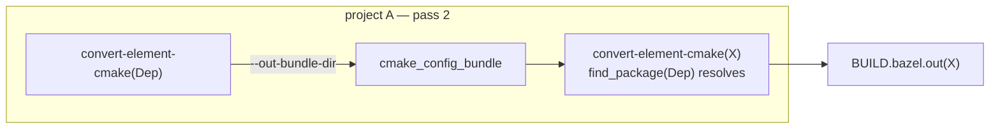
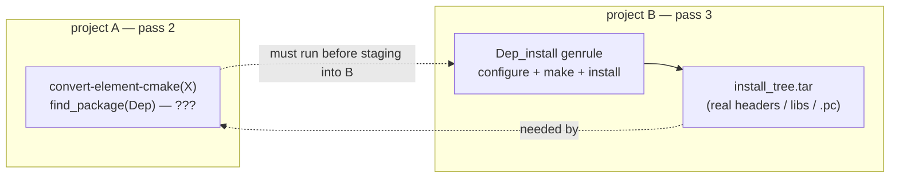
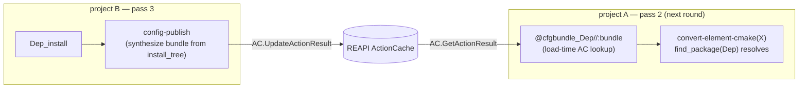

# Cross-element configure-step bootstrap: the config-bundle rendezvous

`docs/three-pass-flow.md` establishes the pass structure; this
doc is about a specific ordering hazard inside it.

A `kind:cmake` (and, with the same shape, `kind:meson`) element
converts in **pass 2** — `bazel build` of project A runs
`convert-element-cmake`, which runs cmake's *configure* step. If
that element's `CMakeLists.txt` does `find_package(Dep CONFIG)`
or `pkg_check_modules(Dep ...)`, configure needs **build-config
metadata for `Dep`** — a `DepConfig.cmake`, a `Dep.pc`, or
failing those the actual installed headers and libs — *at pass-2
time*.

Where that metadata comes from depends on `Dep`'s kind, and one
case has a genuine ordering gap.

## Case 1 — the all-cmake case (works today)

When `Dep` is itself `kind:cmake`, the metadata is a **pass-2
artifact**. `convert-element-cmake --out-bundle-dir` synthesizes a
cmake-config bundle (`DepConfig.cmake` + per-config
`DepTargets-*.cmake`) directly from cmake's File API codemodel —
no build of `Dep` is required, only its graph introspection. The
bundle ships as `//elements/<dep>:cmake_config_bundle` (a
`cmake-config-bundle.tar` filegroup).

The consumer's `<elem>_converted` genrule lists each
`kind:cmake` dep's `cmake_config_bundle` in `srcs`, extracts it
into a per-element synth-prefix under `$PREFIX/lib/cmake/<dep>/`,
and passes `--prefix-dir=$PREFIX`. `find_package(Dep CONFIG)`
resolves against it.

The load-bearing trick (`internal/synthprefix`): the bundle does
**not** need real built artifacts. cmake's import-check loop in
`DepTargets.cmake` is `if(NOT EXISTS ...)`, which passes against
**zero-byte stub files** at every `IMPORTED_LOCATION_<CONFIG>`
path and `mkdir`-stubs at every `INTERFACE_INCLUDE_DIRECTORIES`
path. Configure only needs the *names and shape* of the dep's
targets, not their bytes — and the codemodel has those at pass 2.

The actual cross-element dep *edge* in the rendered
`BUILD.bazel.out` does not come from the bundle at all; it comes
from `imports.json` (the imports manifest, `internal/manifest`),
which maps the cmake imported-target name `Dep::dep` to the Bazel
label `//elements/<dep>:<dep>`. The bundle's only job is to make
configure *pass*; the manifest carries correctness.



One pass. No build. This case is shipped.

## Case 2 — the non-cmake dependency case (the gap)

When `Dep` is a **trace-based kind** (`kind:autotools`,
`kind:make`, `kind:manual`, `kind:script`, `kind:makemaker`,
`kind:modulebuild`) there is **no pass-2 artifact at all**:

- `convert-element-trace` only emits `BUILD.bazel.out` (cc
  rules), and even that only after a trace exists.
- The real headers, libs, and any `.pc` files the dep installs
  live in `install_tree.tar` — a **pass-3** output of project B.
- There is no codemodel to synthesize a config bundle from
  without running the build.

`cmakeDepBundleLabels` (`cmd/write-a/handler_cmake.go`) makes
this concrete: it filters to `dep.Bst.Kind == "cmake"` and skips
every other kind *silently*. So a `kind:cmake` element with a
trace-based dep gets **nothing** staged for that dep, and its
pass-2 configure fails `find_package`/`pkg_check_modules` unless
the dep happens to resolve as a host/system library.

The ordering hazard, stated plainly:

> X's **pass-2** configure needs Dep's build-config metadata,
> but for a trace-based Dep that metadata only exists after
> Dep's **pass-3** install build.



Note this is *not* a per-element cycle — Dep's `install_tree.tar`
does not depend on X — but it **is** a pass-ordering inversion:
the thing X's pass 2 needs is produced by a later pass.

## Recommended solution: generalize the config-bundle rendezvous

The project already solved a structurally identical problem once:
the `kind:autotools` round-2 rendezvous
(`docs/design/autotools-round2-rendezvous.md`). A trace produced
at pass 3 has to reach a converter that runs at pass 2; the
answer is the REAPI ActionCache as an indirect, asynchronous
channel between the two passes — no Bazel edge, no extra infra.

Apply the same mechanism to the config bundle.

### Producer side — pass 3, project B

A trace-based element's `<elem>_install` genrule already produces
`install_tree.tar` and already ends with an inline `trace-publish`
call. Add one step: **synthesize a config bundle from the real
install tree and publish it to the AC**.

Because pass 3 has the *actual* installed layout, the synthesized
bundle is high-fidelity, not a guess:

- `.pc` files the element installed under `lib/pkgconfig/` are
  copied verbatim.
- For elements that install no `.pc`, synthesize a
  `<Pkg>Config.cmake` + `<Pkg>Targets.cmake` from the observed
  `include/` directories and `lib*.{a,so,dylib}` basenames in
  the install tree — the same bundle shape `internal/synthprefix`
  already understands.
- Real headers and libs are available too; the bundle can carry
  them (rather than zero-byte stubs) when a consumer's configure
  actually compiles a probe (`check_include_file`,
  `pkg_check_modules` with a test compile). This is the "failing
  that, actual headers and libs installed" path from the problem
  statement — and pass 3 is exactly where they exist.

Publish under the dep's srckey, reusing
`tracenorm.SyntheticActionDigest(srckey, platform)` but with a
**distinct argv0 namespace** so config-bundle entries and trace
entries don't collide in the keyspace (see "The synthetic key"
below). A new `cmd/config-publish` (sibling of `cmd/trace-publish`)
does the upload; or `trace-publish` grows a `--config-bundle`
flag and publishes both under the two keys in one call.

### Consumer side — pass 2, project A

The `kind:cmake` consumer's `<elem>_converted` genrule gains, per
**non-cmake** dep, a `@cfgbundle_<dep>//:bundle` external repo —
a load-time AC lookup mirroring `@trace_<elem>//:trace` in
`rules/traces.bzl`:

- **AC hit** ⇒ the fileset resolves to the dep's
  `cmake-config-bundle.tar`; the genrule extracts it into the
  synth-prefix exactly as it does for a `kind:cmake` dep's
  bundle today. `find_package` / `pkg_check_modules` resolves.
- **AC miss** ⇒ empty fileset; the consumer takes the bootstrap
  path below.

`cmakeDepBundleLabels` stops filtering to `dep.Bst.Kind ==
"cmake"`: cmake deps contribute their pass-2
`//elements/<dep>:cmake_config_bundle` filegroup as today;
non-cmake deps contribute `@cfgbundle_<dep>//:bundle`. Both feed
the same `$PREFIX` extraction loop — one code path downstream.



### The synthetic key

Reuse `SyntheticActionDigest` unchanged in mechanism, but
namespace the config-bundle keyspace separately from the trace
keyspace. The cleanest seam is a second argv0 constant in
`internal/tracenorm/synthkey.go` —
`cmake-to-bazel/config-publish-marker/v1` alongside the existing
`cmake-to-bazel/trace-publish-marker/v1` — exposed via a
`SyntheticConfigDigest(srckey, platform)` wrapper. Same
deterministic-marshal guarantees, same per-`(srckey, platform)`
partitioning, same `v1`→`v2` rotation lever. A trace and a config
bundle for the same element coexist at distinct AC keys.

The dep's srckey is the *dep's* per-element content digest — the
consumer's genrule already has cause to know its deps' srckeys
(it lists their outputs), and `write-a` computes all of them at
pass 1.

### Bootstrap — the first round, before any AC entry exists

On the first build of a `(consumer, dep)` pair the AC has no
config bundle. Two viable miss-path behaviours; the doc
recommends offering both, operator-selectable, defaulting to (a):

**(a) Deferred placeholder (default).** The consumer emits a
typed *placeholder* `BUILD.bazel.out` — the same fail-soft shape
trace-driven kinds already emit on a trace-AC miss — and the
convergence driver (next section) knows not to build this
element in project B yet. Cost: the consumer is degraded for one
extra round. No guessing, never wrong.

**(b) Stub bundle from `.bst` public metadata.** `write-a`
synthesizes a *stub* config bundle at pass 1 from operator-declared
`public:` data on the dep's `.bst` (exported package name,
exported headers, exported lib names) — a minimal
`<Pkg>Config.cmake` + `Pkg.pc` with zero-byte stubs, leaning on
the same `if(NOT EXISTS)` tolerance Case 1 relies on. Configure
passes on round 1; the published round-2 bundle then *refines*
the include/lib facts. Risk: if the operator's declared metadata
is wrong, configure fails or silently mis-resolves. This is why
it's opt-in, not default.

In both cases the dep *edge* still comes from `imports.json`, not
the bundle — so a placeholder round costs fidelity of the
*consumer's own* rules (it can't introspect itself without its
deps present), never correctness of the cross-element wiring.

This bootstrap path is the natural place to extend the imports
manifest to carry exported-header / exported-lib data — which is
already a queued `ROADMAP.md` item for the gazelle cross-element
index. The producer side of that schema extension is the pass-3
`config-publish` step described here.

## The convergence driver — a fixpoint over the DAG

The miss-path placeholder means a single `bazel build A; stage;
bazel build B` is no longer guaranteed to converge in one shot.
The driver script becomes a **fixpoint loop** — and this is
essentially the loop sketched in the issue ("build everything in
A until an input is missing, build B until a build config is
missing, loop back to A"):

```
loop:
  bazel build //... over project A
      every element converts as far as it can:
        - cmake element, all dep bundles available  ⇒ fine-grained BUILD
        - cmake element, a non-cmake dep bundle missing ⇒ placeholder BUILD
        - trace element ⇒ converter genrule (placeholder until its trace lands)
  stage project A's BUILD.bazel.out files into project B
  bazel build //... over project B, skipping elements still on a placeholder BUILD
      every buildable element builds:
        - trace element ⇒ install_tree.tar + trace-publish + config-publish
        - cmake element ⇒ native cc rules
  if this round published no new trace or config bundle: STOP (fixpoint)
  else: goto loop
```

Why it terminates: the `.bst` dependency graph is a DAG
(BuildStream rejects dependency cycles). Each round, every
element at the current "frontier" — one whose deps have all
published whatever they owe — resolves and never regresses
(traces and bundles are content-addressed and deterministic).
The number of rounds is bounded by the longest
*configure-needing* chain in the graph: a `cmake → trace → cmake
→ trace → ...` alternation. In practice that depth is small;
pure-cmake subgraphs and trace-leaf subgraphs each converge in
one round.

Why "skip on placeholder" is safe: project B's install genrule
for a trace element depends only on that element's *sources* (and
its deps' install trees), never on project A — so a trace
element at the frontier always builds in B even while a cmake
consumer above it is still a placeholder. The skip only defers
elements whose B-side BUILD is genuinely not yet known.

The driver already has the changed-element signal it needs:
`cmd/stage-b` emits a content diff of staged `BUILD.bazel.out`s
(see the Phase 8b ROADMAP entry). "Published something new this
round" is computable from the same signal plus the set of
install genrules that ran.

## Alternatives considered

### A direct Bazel dependency edge from A onto B's output

The intuitive fix — make X's pass-2 converter genrule *directly*
`srcs`-depend on `//elements/<dep>:<dep>_install`'s
`install_tree.tar` — was considered and rejected:

- **Two workspaces.** Project A and project B are separate Bazel
  modules with separate `MODULE.bazel`. A literal label edge
  across them requires either merging them into one workspace
  (a large structural change that blurs the A/B contract in
  `docs/build-structure.md`) or a repository rule in A that
  shells `bazel build` into B at load time.
- **The repo-rule variant doesn't run on RBE** and does
  loading-time work that blocks Bazel startup — the same
  trade-offs already enumerated for the "repo-rule install for
  kind:cmake round-2 fallback" `ROADMAP.md` item.
- **It permanently couples B to A.** Project B is supposed to
  be the *deliverable* — a maintainable, standalone Bazel
  project after the conversion converges (see "Terminal state"
  below). A structural A↔B edge means B can never be detached
  from A.

The AC rendezvous **is** the A-on-B-output dependency — just
expressed *indirectly* through the action cache rather than as a
Bazel label edge. That indirection is the point: it keeps the
two workspaces independently buildable, survives remote
execution, and leaves no trace in B's final graph.

### Interleaving A and B (build B's trace deps first)

Reorder so a trace-based dep's pass 3 runs before its cmake
consumer's pass 2. This gets one-shot convergence, but it
resurrects exactly the cross-project scheduling the deleted
`orchestrator/` owned (`docs/design/orchestrator-absorption.md`).
The whole reason the orchestrator was absorbed into the write-a +
Bazel two-pass shape is that Bazel should own scheduling. The
fixpoint driver keeps Bazel as the scheduler *within* each pass
and adds only a thin outer loop — it does not re-introduce a
bespoke scheduler.

## Terminal state — B is self-contained, A is transitional

The constraint that "B should be a maintainable Bazel project
after the conversion completes" holds under this design, and
it's worth being explicit about why:

- **B never reads the rendezvous AC.** Only project A's
  converter genrules call `trace-lookup` / the config-bundle
  lookup. Project B's install genrules *publish* to the AC but
  never *consume* from it; B's cc rules are pure Bazel. So
  `bazel build //...` over project B works with no rendezvous
  cache at all — the AC is a converter-side accelerator, not a
  build input.
- **At the fixpoint, every element has a real BUILD in B** —
  fine-grained `cc_library` / `cc_binary` for introspectable and
  rounded-trace elements, coarse install genrules for the rest.
  No placeholders remain.
- **Project A's job is done at the fixpoint.** Its converter
  genrules exist to *produce* B's BUILD files; once those are
  produced and (optionally) checked in, A can be discarded. This
  is the same "the genrule goes away entirely" end-state the
  three-pass-flow doc describes for autotools round-2, now
  generalized across the cross-kind configure edge.

In short: the rendezvous is scaffolding between A and B during
the transition window. The deliverable — project B — comes out
the far side with no dependency on that scaffolding.

## Reference

| File | Role (today / proposed) |
|---|---|
| `internal/synthprefix/build.go` | bundle shape + zero-byte stub trick (reused as-is by the producer's synthesize step) |
| `internal/manifest/imports.go` | cross-element label map; proposed exported-header/lib schema extension for bootstrap path (b) |
| `cmd/write-a/handler_cmake.go` | `cmakeDepBundleLabels` — proposed: stop filtering to `kind == "cmake"`; emit `@cfgbundle_<dep>//:bundle` for non-cmake deps |
| `internal/tracenorm/synthkey.go` | proposed `SyntheticConfigDigest` + `config-publish-marker/v1` argv0 namespace |
| `cmd/trace-publish` / `cmd/trace-lookup` | publish/lookup precedent; proposed `cmd/config-publish` sibling (or a `--config-bundle` flag on trace-publish) |
| `rules/traces.bzl` | `_trace_repo` precedent; proposed `_config_bundle_repo` sibling |
| `cmd/stage-b` | changed-element signal the fixpoint driver reads to detect "published something new this round" |
| `docs/design/autotools-round2-rendezvous.md` | the structurally identical mechanism this generalizes |

## Gates (proposed)

- A render-half gate (sibling of
  `scripts/meta-autotools-round2.sh`) over a fixture where a
  `kind:cmake` element `find_package`s a `kind:autotools` dep:
  asserts the consumer genrule lists `@cfgbundle_<dep>//:bundle`
  and the producer install genrule runs `config-publish`.
- A live-AC gate (sibling of
  `tools/e2e-meta-autotools-round2-live.sh`): runs the fixpoint
  driver against a real REAPI endpoint, asserts the
  cmake-over-autotools element is a placeholder after round 1
  and a fine-grained `cc_library` after round 2, and asserts the
  driver reaches a fixpoint.

## Status

Case 1 (the all-cmake bundle) and Case 2 (the config-bundle
rendezvous for non-cmake deps) are shipped — see the
cross-element configure-step bootstrap PR stack in
[`ROADMAP.md`](../../ROADMAP.md). The fixpoint driver is queued
behind the stack's PR-5.

Shipped (Case 2 details):

- `tracenorm.SyntheticConfigDigest(srckey, platform)` partitions
  the config-bundle keyspace from the trace keyspace via a
  distinct argv0 marker (`cmake-to-bazel/config-publish-marker/v1`
  vs the trace's `cmake-to-bazel/trace-publish-marker/v1`).
  A trace and a bundle for the same `(srckey, platform)` coexist
  at distinct AC keys.

- `cmd/trace-publish --config-bundle=<path>` publishes the bundle
  alongside the trace in a single invocation. Both blobs upload
  to CAS; both AC keys land via `UpdateActionResult`. Single
  network round trip from the producer's perspective.

- `cmd/trace-lookup --out-config-bundle=<path>` materializes the
  bundle alongside the trace at the consumer's action time.
  Bundle hit/miss is independent of trace hit/miss; on bundle
  miss, a zero-byte file lands at the destination.

- `rules_buildstream_bazel//rules:traces.bzl`'s `trace_load`
  rule gains `expect_config_bundle: bool` (default False).
  When True, the rule declares an additional output
  `<name>/cmake-config-bundle.tar`.

- write-a's round-2 install-genrule templates (cmake / meson /
  autotools / pipeline kinds) append a config-bundle synthesis
  step: walk `$INSTALL_ROOT/lib/pkgconfig/` and
  `$INSTALL_ROOT/lib/cmake/<Pkg>/`, tar them into
  `cmake-config-bundle.tar`, pass to `trace-publish --config-bundle`.
  No synthesis from include/lib directory walks (the design
  doc's "fallback shape") in v1 — elements that install neither
  pkg-config files nor cmake-config files produce an empty
  bundle. Operators can extend the synthesis step in a future
  pass; the wire shape supports it.

- write-a's `cmakeDepBundleLabels` retires the
  `kind == "cmake"` filter. Trace-driven deps (autotools / make /
  makemaker / modulebuild / manual / script, plus cmake / meson
  under their round-2 fallback shapes) get
  `:<dep>_trace_load` staged into the consumer's srcs. The
  consumer's existing dep-extract shell loop matches
  `cmake-config-bundle.tar` by basename — same shape regardless
  of whether the dep is kind:cmake (the bundle lives in a
  `:cmake_config_bundle` filegroup) or trace-driven (the bundle
  is one output among trace_load's output set).

Not in v1 (queued):

- `mesonDepBundleLabels` still filters to `kind == "meson"`.
  Extending it follows the same pattern as `cmakeDepBundleLabels`
  but exercises a different consumer shape (the meson element's
  configure step needs `PKG_CONFIG_PATH`, not
  `CMAKE_PREFIX_PATH`). Lands when an FDSDK fixture surfaces a
  meson-element-with-trace-driven-dep case.

- Fixpoint driver (PR-5). v1 ships the publish/consume wire
  contract; the convergence loop that bumps
  `--action_env=CONVERGE_GENERATION` between rounds is queued.
