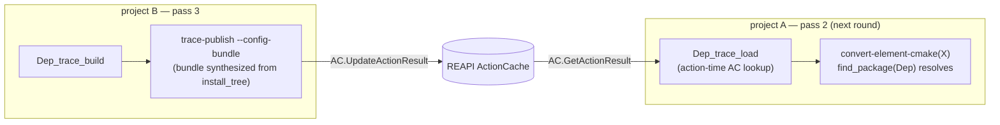

# Round-2 rendezvous via the REAPI ActionCache

For the architectural framing (why a rendezvous exists, how it fits
between project A and project B, what the convergence loop does)
see [`conversion-architecture.md`](conversion-architecture.md) and
[`../architecture.md`](../architecture.md). This doc is the
implementation reference: the synthetic Action proto, the two
keyspace partitions (trace + config bundle), canonicalization,
eviction resilience, kind-generality.

## The shape

```
write-a  →  project A: per-element converter genrule
                       + per-element trace_load target
            project B: per-element trace_build genrule
                       (configure + make + install
                        + build-tracer + inline publish)

bazel build A//<elem>:<elem>_converted
   pass-2:
     :<elem>_trace_load action  (rules/traces.bzl trace_load rule)
       → cmd/trace-lookup --srckey=<hex>
                          --out-trace=... --out-make-db=...
                          --out-config-bundle=...
                          --out-empty-marker=...
         → SyntheticActionDigest(srckey, platform)
         → AC.GetActionResult(synthetic_key)
         → AC hit  ⇒ MaterializeDirectory writes trace.log
                     (+ make-db.txt + cmake-config-bundle.tar)
                     into declared outputs; marker = "hit\n"
         → AC miss ⇒ zero-byte trace.log (+ make-db.txt
                     + cmake-config-bundle.tar) + marker = "miss\n"
     converter genrule action (srcs include :<elem>_trace_load)
       → convert-element-trace --trace-dir=<staged>
         → trace.log non-empty ⇒ emit cc_library / cc_binary
         → trace.log empty     ⇒ emit placeholder BUILD.bazel.out

bazel build B//<elem>:<elem>_trace_build
   pass-3 trace_build genrule (tagged "trace_build"):
     configure / make / make-install under build-tracer
     post-process make-db (sed filter)
     synthesize cmake-config bundle from
       $INSTALL_ROOT/lib/{pkgconfig,cmake/<Pkg>}
     trace-publish:
       canonicalize trace + filter make-db (defense-in-depth)
       cas.UploadDir(<staged dir>)        → root Directory digest
       AC.UpdateActionResult(SyntheticActionDigest(srckey, platform),
                             ActionResult{output_directories: [...]})
       publishConfigBundle:
         cas.UploadDir(<bundle-tar dir>)  → bundle root digest
         AC.UpdateActionResult(SyntheticConfigDigest(srckey, platform),
                               ActionResult{output_directories: [...]})
```

The pass-3 genrule is tagged `trace_build` so the convergence driver
can query the set via `bazel query 'attr(tags, trace_build,
//elements/...:*)'`. Cross-element consumers reference
`//elements/<dep>:install_tree.tar` (a stable filegroup) rather than
the genrule name directly.

The action-time `trace_load` rule replaced an earlier load-time
`_trace_repo` repository rule. The lookup now runs as a normal Bazel
action against a staged `//tools:trace-lookup` binary; bytes are
fetched via gRPC `MaterializeDirectory` rather than a FUSE mount, so
the rendezvous no longer requires `bb_clientd` for the input side.
Bazel's `ActionCache` controls re-runs; the convergence driver forces
re-querying between rounds by bumping
`--action_env=CONVERGE_GENERATION=<n>`.

## The synthetic key

Both publisher and consumer derive their AC key from the same srckey
hex (the content of `srckey.txt`, the per-element content-narrowed
digest computed by `cmd/write-a/srckey.go`). The key is the digest
of a synthetic REAPI Action proto that's never executed:

```go
Command{ arguments: [<argv0 marker>, srckey, platform] }
Action {
  command_digest:    digest(Command)
  input_root_digest: digest(empty Directory)
  do_not_cache:      false
}
synthetic_key = digest(Action)
```

REAPI's AC doesn't care whether anyone ran the Action; it's just a
content-addressed store keyed by Action digest.

**Stability.** Both `trace-publish` and `trace-lookup` call
`tracenorm.SyntheticActionDigest(srckey, platform)` (in
`internal/tracenorm/synthkey.go`), which uses `cas.DigestProto` —
the deterministic-marshal helper the rest of the cache layer uses.
Same srckey + same Go build of `internal/tracenorm` ⇒ same key on
every machine.

**Two keyspace partitions.** The argv0 namespace lets a trace and a
config bundle for the same `(srckey, platform)` coexist at distinct
AC keys:

| Helper | argv0 marker | Payload |
|---|---|---|
| `SyntheticActionDigest(srckey, platform)` | `cmake-to-bazel/trace-publish-marker/v1` | trace.log + make-db.txt |
| `SyntheticConfigDigest(srckey, platform)` | `cmake-to-bazel/config-publish-marker/v1` | cmake-config-bundle.tar |

Bumping a trailing `v1` to `v2` rotates every stored entry — what
we'd do if the on-disk schema changed enough that older entries
shouldn't satisfy newer lookups.

## Why AC + REAPI, not a sidecar JSON

Three mechanisms could host the srckey → trace mapping. We
considered:

1. **Checked-in `traces.json`** updated by a `trace-push` step
   committed alongside the `.bst`. Rejected — pollutes review with
   build-output digests, no cross-team sharing.
2. **A new sidecar registry service** (small REST endpoint).
   Rejected — operational burden, another infra component to deploy
   + secure + monitor.
3. **The AC of whatever REAPI cache the team is already running**
   (buildbarn, bb_clientd-as-CAS-frontend, RBE provider). Picked.
   Zero new infra: every machine that runs `bazel build` against the
   meta-project already has access.

The publisher / consumer don't need REAPI's *execution* side — just
`GetActionResult` / `UpdateActionResult` / `FindMissingBlobs` /
`BatchUpdateBlobs`. Existing `internal/cas` GRPCStore covers all of
these.

## Cross-node convergence

The AC is shared infrastructure. A fresh CI runner doesn't have its
own AC — it talks to the same one every other runner and dev
machine talks to:

- The very first build of a given srckey **anywhere** hits the miss
  path: pass-2 lookup misses → pass-3 trace_build runs → trace +
  bundle land in AC under `synthetic_key=fn(srckey, platform)`.
- All subsequent builds of the same srckey **anywhere** get the hit
  path: pass-2 lookup hits → fine pass-3 cc compile.
- A srckey change (graph-affecting source edit) is a fresh
  rendezvous: lookup misses for the new key, pass-3 trace_build
  re-runs, publishes under the new key. The old key's AC entry stays
  reachable for any developer / branch still on the old source —
  natural per-srckey isolation.

For byte-identical AC entries from two nodes building the same
srckey, two layers of stability are needed:

- **Trace canonicalization** — pid stripping + gcc temp-path
  placeholders + sandbox prefix substitutions. Lives in
  `internal/tracenorm/canonicalize.go` (lifted from build-tracer
  pre-round-2 so `trace-publish` can re-apply it defensively).
- **make-db filtering** — drop the variant lines (mtimes, file-count
  summaries, db-print timestamps). Lives in
  `internal/tracenorm/makedb.go`.

The pipeline genrule applies both inline at action time (via
`build-tracer` and a sed pipeline). `trace-publish` re-applies them
in-process before computing digests, so a publisher whose upstream
`build-tracer` is older or whose genrule's sed filter is missing a
line still lands a stable digest.

## Eviction resilience

If the AC entry survives but the referenced trace blob gets evicted
from CAS, `trace-lookup` returns a miss (it calls `FindMissing`
after reading the AR; non-empty ⇒ blob gone ⇒ treat as miss). The
pass-3 trace_build then re-runs and re-publishes under the same
synthetic key. Self-healing. Same logic for the config-bundle
keyspace.

## The cross-element configure-step bootstrap

A `kind:cmake` element `X` with `find_package(Dep CONFIG)` against a
`kind:autotools` dep needs build-config metadata for `Dep` at *X's
pass-2 time* — but for a trace-based `Dep` that metadata only exists
after `Dep's pass-3 install build`. This is the same pass-ordering
inversion the trace rendezvous solves; the config bundle rides the
same machinery with its own keyspace.

Two cases:

**cmake → cmake** (works as a pure pass-2 artifact, no AC needed).
`convert-element-cmake --out-bundle-dir` synthesizes a cmake-config
bundle (`DepConfig.cmake` + per-config `DepTargets-*.cmake`) directly
from cmake's File API codemodel. No build of `Dep` is required, only
its graph introspection. The bundle ships as
`//elements/<dep>:cmake_config_bundle` (a `cmake-config-bundle.tar`
filegroup) and the consumer's `<elem>_converted` genrule extracts it
into a per-element synth-prefix at `$PREFIX/lib/cmake/<dep>/`. The
load-bearing trick (`internal/synthprefix`): the bundle doesn't need
real built artifacts. cmake's import-check is `if(NOT EXISTS ...)`,
which passes against zero-byte stubs at every `IMPORTED_LOCATION_<CONFIG>`
path. Configure only needs the names and shape of the dep's targets,
not their bytes. The actual cross-element dep *edge* in the rendered
`BUILD.bazel.out` comes from `imports.json`, not the bundle.

**cmake → non-cmake** (the AC rendezvous case). The producer's
`<elem>_trace_build` synthesizes a bundle from the *real* installed
layout — `.pc` files from `$INSTALL_ROOT/lib/pkgconfig/`,
`<Pkg>Config.cmake` + `<Pkg>Targets.cmake` from observed `include/`
and `lib*.{a,so,dylib}` paths. `trace-publish --config-bundle=<tar>`
uploads it and registers under `SyntheticConfigDigest(srckey, platform)`.
The consumer's `<dep>_trace_load` materializes it alongside the
trace; `cmakeDepBundleLabels` (`cmd/write-a/handler_cmake.go`) no
longer filters to `kind == "cmake"`, so trace-driven deps contribute
their `:<dep>_trace_load` output to the consumer's srcs and the
existing dep-extract shell loop matches `cmake-config-bundle.tar`
by basename regardless of which producer kind shipped it.



## Generality across kinds

The rendezvous is kind-agnostic — `trace_load`,
`SyntheticActionDigest`, `trace-publish`, and `trace-lookup` all key
off a srckey-string + platform and don't know what kind produced the
trace.

| Kind | Opt-in |
|---|---|
| `kind:autotools` | Direct (`handler_autotools_native.go`) |
| `kind:make` / `makemaker` / `modulebuild` / `manual` / `script` | `traceDrivenSrckeyPatterns` on the registered `pipelineHandler` |
| `kind:cmake` / `kind:meson` | Under their round-2 fallback flags (`*Config.round2FallbackEnabled`) — the Phase B fallback shape |

Per-kind srckey-narrowing decisions:

- **kind:make** — `Makefile` + `**/Makefile` + `**/*.h` family. `.c`
  content is path-only (recipes don't depend on it).
- **kind:makemaker** — `Makefile.PL` + `**/Makefile` + `**/*.xs` +
  `**/*.h` family. `*.pm` path-only; `*.c` typically generated from
  `*.xs`, so path-only.
- **kind:modulebuild** — `Build.PL` + `**/*.xs` + `**/*.h` family.
- **kind:manual** + **kind:script** — empty rule set →
  content-included for every file. The `.bst`'s commands could be
  anything; per-element narrowing is available via the existing
  `read-paths.txt` sibling.

Further trace-driven kinds join with one line in `init()` setting
`traceDrivenSrckeyPatterns`. The pattern set's job is deciding which
file paths gate the BUILD COMMANDS (content-included) vs which only
affect compile OUTPUT bytes (path-only).

## Why not a direct Bazel edge from A onto B's output

The intuitive fix — make X's pass-2 converter genrule directly
`srcs`-depend on `//elements/<dep>:<dep>_install`'s
`install_tree.tar` — was considered and rejected. Two workspaces:
project A and project B are separate Bazel modules with separate
`MODULE.bazel`. A literal label edge across them requires either
merging them into one workspace (a structural change that blurs the
A/B contract) or a repository rule in A that shells `bazel build`
into B at load time. The repo-rule variant doesn't run on RBE and
does loading-time work that blocks Bazel startup. And it permanently
couples B to A — project B is supposed to be the *deliverable*. A
structural A↔B edge means B can never be detached.

The AC rendezvous **is** the A-on-B-output dependency — expressed
indirectly through the action cache rather than as a Bazel label
edge. That indirection is the point: it keeps the two workspaces
independently buildable, survives remote execution, and leaves no
trace in B's final graph.

## Gates

- `scripts/meta-autotools-round2.sh` — render-half gate. Locks in
  the rendered shape (project A converter genrule, project B
  trace_build + trace-publish). Runs without buildbarn.
- `tools/e2e-meta-autotools-round2-live.sh` — live-AC gate. Stands
  up buildbarn, runs `trace-publish` against the real REAPI
  endpoint, asserts the published digest round-trips. Also exercises
  the bundle keyspace.
- `tools/e2e-meta-trace-driven-re.sh` — trace_load + converter
  genrule under RBE + build-without-the-bytes.
- `tools/e2e-meta-cross-kind-re.sh` — full kind:cmake +
  kind:autotools end-to-end under RBE + bwotb.
- `tools/e2e-meta-trace-build-on-worker.sh` — `trace_build` itself
  runs configure + make + install + publish on a remote worker (not
  pre-staged synthetic bytes).

## Reference

| File | Role |
|---|---|
| `internal/tracenorm/canonicalize.go` | trace-line shaping |
| `internal/tracenorm/makedb.go` | make-db variant-line drop list |
| `internal/tracenorm/synthkey.go` | `SyntheticActionDigest` + `SyntheticConfigDigest` recipes |
| `cmd/trace-publish/main.go` | publisher (runs inline in pass-3 trace_build) |
| `cmd/trace-lookup/main.go` | consumer (shells out from the `trace_load` rule's action) |
| `cmd/write-a/handler_pipeline_round2.go` | kind-agnostic round-2 helpers used by every trace-driven kind |
| `cmd/write-a/handler_cmake.go` | `cmakeDepBundleLabels` — emits `:<dep>_trace_load` for non-cmake deps |
| `rules_buildstream_bazel/rules/traces.bzl` | `trace_load` rule (with `expect_config_bundle`) |
| `tools/converge.sh` | the fixpoint driver consuming these primitives |

## Status

Shipped — both the trace keyspace and the config-bundle keyspace,
including the cross-element configure-step bootstrap for non-cmake
deps. For what's queued, see [`ROADMAP.md`](../../ROADMAP.md). The
meson-consumer-of-trace-driven-dep case is the known gap (cmake-side
helper lands first; meson side follows the same pattern but exercises
`PKG_CONFIG_PATH` rather than `CMAKE_PREFIX_PATH`).
