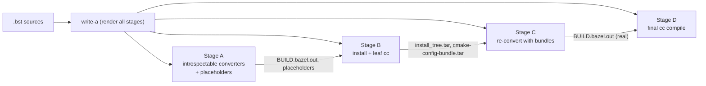

# Architecture reconsidered: the staged conversion pipeline

This doc is **exploratory**. It captures a structural alternative
to today's two-project (project A + project B) conversion shape:
a staged **A → B → C → D pipeline** where each stage is its own
Bazel project, content flows strictly forward (a lower letter
never depends on a higher one), and **D is the standalone Bazel
project the conversion yields**.

It is not a commitment to land the change. The existing
two-project shape works and is what `cmd/write-a` emits today;
the staged shape is what the architecture might look like if
reconsidered with the benefit of how the AC-rendezvous + round-2
loop ended up working, *and* with bb_clientd + Bazel-9 CAS-FS
already in hand.

## Why "reconsidered"

The two-project A/B shape predates the bb_clientd + Bazel-9
CAS-FS work (`docs/design/bazel9-cas-fs.md`). When A and B were
designed, sharing artifacts between two separate Bazel
workspaces meant some form of out-of-band channel —
filesystem-staging directories plus synthetic AC keys plus
load-time repo rules. That's why
`docs/design/autotools-round2-rendezvous.md` exists: it's the
machinery for sharing one action's output with a different
project's action when no Bazel edge can connect them.

With `bazel-bin/` available as a CAS-backed FUSE mount and
Build-without-the-Bytes as the operational target,
cross-workspace artifact sharing can ride standard Bazel `srcs`
edges instead. The operative constraint that justified the
mutually-recursive loop shape no longer applies; the question
"would we still draw the project boundary at A/B?" reopens.

## Today's shape, briefly

```
write-a → project A + project B
bazel build A             # converters
stage A's BUILD.bazel.out into B
bazel build B             # install + cc;
                          # trace-publish lands trace under SyntheticActionDigest(srckey)
bazel build A             # converters now consume @trace_<elem>//:trace
                          # refines placeholder BUILDs into fine-grained cc rules
stage into B
bazel build B             # compiles fine-grained cc
```

What's awkward about it, structurally (not as UX — UX is a
separate question, addressable independently):

- **A's output `BUILD.bazel.out` for a cmake-on-trace element X
  is a placeholder after one round and the real BUILD after the
  next.** The artifact path has time-dependent semantics.
- **The AC-rendezvous machinery exists specifically because A
  and B have no Bazel edge between them.** It's a workaround
  for the project boundary choice, not a fundamental.
- **Repo-rule load-time effects churn Bazel's analysis cache.**
  `@trace_<elem>//:trace`'s output changes between rounds (AC
  miss → AC hit), invalidating analysis-cache entries. The loop
  works; it just sits outside Bazel's normal incrementality.

## The staged shape

Four projects, content flows strictly **A → B → C → D**.

| Stage | What it contains | What it produces |
|---|---|---|
| **A** | Per-element converter genrules whose inputs are sources only | `BUILD.bazel.out` + sidecars for every element that can convert from sources alone (cmake-on-cmake at any depth, cmake leaves) **plus a placeholder** for elements whose converter needs a dep build first |
| **B** | Per-element install + cc genrules consuming A's outputs | `install_tree.tar` for trace-based kinds, cc artifacts for introspectable kinds, **a `cmake-config-bundle.tar` synthesized from each trace-based element's real install tree** as a sibling output |
| **C** | Per-element re-converter genrules consuming B's bundles | Real `BUILD.bazel.out` for elements A could only placeholder (cmake-on-trace, meson-on-trace) |
| **D** | Per-element cc genrules consuming C's outputs (and any of A's that survived to D) | Final binaries / libraries. **D is the standalone Bazel project.** |

Each stage is a normal Bazel workspace with its own
`MODULE.bazel`, its own per-element `BUILD.bazel`, and inputs
that are either source bytes or outputs of a strictly earlier
stage. No stage reads outputs of a later stage. No stage reads
outputs of itself from an earlier invocation. Bazel sees a DAG;
the driver runs `bazel build` on each stage in order.



### Per-element subset

Not every element has work in every stage. write-a stratifies
the `.bst` graph by "first stage where this element has actual
work" and emits BUILD content per stage accordingly:

| Element shape | Stages with work |
|---|---|
| `kind:cmake` leaf | A (convert) → B (cc) |
| `kind:cmake` on `kind:cmake` (any depth) | A → B (cmake's codemodel introspects siblings without building them) |
| Trace-based leaf (`kind:autotools`, `kind:make`, etc.) | B (install + bundle synthesis) |
| `kind:cmake` on trace-based | A (placeholder) → C (real convert) → D (cc) |
| Trace-based on `kind:cmake` | B (install + bundle; the cmake dep's B-output is a B-internal input) |
| `kind:cmake` on (trace-on-cmake) | A (placeholder) → C → D |

The alternation depth that matters is "consecutive transitions
between a kind that needs introspection (cmake / meson) and a
kind whose config bundle requires a build." A…D covers depth 2.
For the transition-tool framing (BuildStream → standalone Bazel
for projects like FDSDK) depth ≤ 2 is the common case — heavy
autotools components are typically leaves; cmake-glue layers
sit one level above. Depth-3+ graphs are the corner case (see
"Costs and unknowns" below).

## Convergence via standard REAPI machinery

The reason the stages can be independent Bazel projects without
bespoke rendezvous between them is **standard RE +
Build-without-the-Bytes**, paired with **bb_clientd serving
`bazel-bin/` as a CAS-backed FUSE mount**.

- Each stage's actions run under `--remote_executor`. Outputs
  go into CAS; AC entries get written under Bazel's normal
  action digest.
- A downstream stage's `local_repository` (or a small custom
  repo rule) points at the upstream stage's `bazel-bin/`.
  Because `bazel-bin/` is the bb_clientd FUSE mount, the path
  resolves to CAS blobs rather than local-disk files —
  BwotB-friendly. The downstream stage's actions reference the
  upstream artifacts by digest; no bytes need to land on the
  driving runner.
- A second CI runner builds the upstream stage independently;
  byte-equal inputs → same action digest → AC hit; its
  `bazel-bin/` resolves the same CAS blobs through the same
  FUSE protocol. The downstream stage on that runner sees the
  same input digests and AC-hits its own actions.

Cross-node convergence, mid-pipeline resume, "no bytes on the
runner that doesn't need them" all fall out of standard REAPI +
BwotB + FUSE. None of these properties require a bespoke
synthetic-key channel — the synthetic key was specifically a
workaround for *not having a Bazel edge*, and the staged shape
restores the edge.

The one precondition: produced outputs must be byte-stable from
byte-stable inputs. Today's `build-tracer` + canonicalization
+ sed-filter pipeline (`internal/tracenorm/canonicalize.go` +
`makedb.go` + the install genrule's filter) already guarantees
this. Standard REAPI then takes over.

## srckey vs. SyntheticActionDigest

These are two different things; the proposal keeps the first
and retires the second from the primary path.

**srckey stays load-bearing — for narrowing, not for
rendezvous.** The per-kind read-paths patterns + per-element
`read-paths.txt` sibling decide what counts as graph-affecting
content vs. name-only; srckey is the per-element
content-narrowed digest those patterns produce. That digest
gates Bazel's normal action-cache invalidation by being a
(narrow) component of the converter action's `srcs` —
giving kind:cmake the "`.c`-only edits cache-hit at the
convert action" property and the trace-driven kinds the
equivalent. Conversion stability is the same in the staged
shape as in today's, and srckey is the mechanism in both.

**`SyntheticActionDigest` retires from the primary path.** It
was specifically the AC-rendezvous channel: a fake REAPI Action
whose digest is computed from `(srckey, platform)` so two sides
could agree on an AC key without going through Bazel's normal
action-digest machinery. In the staged shape both sides go
through Bazel's normal action-digest machinery — stage C's
converter has stage B's `cmake-config-bundle.tar` (and
`trace.log`) as `srcs` inputs; AC keying is the standard action
digest of the C action; no parallel synthetic keyspace required.

Consequences:

- `cmd/trace-publish` / `cmd/trace-lookup` aren't needed in the
  primary path. Trace + bundle become normal outputs of stage
  B's install genrule.
- `rules/traces.bzl`'s `_trace_repo` load-time AC lookup also
  isn't needed in the primary path. The cross-stage edge is a
  `local_repository` (or equivalent), resolved once at stage C
  load time against a stable CAS-backed FUSE path.

These pieces don't have to be deleted — they could stay as the
mechanism a depth-≥3 loop-fallback uses (see below). But they
stop being load-bearing for the common case.

## Terminal state

D is the deliverable: a standalone Bazel project whose
`BUILD.bazel` files are real (no placeholders), whose dep edges
are real labels, whose only inputs are source bytes and Bazel
rules. The operator can check D in, archive A/B/C, and continue
with plain `bazel build` over D thereafter.

The "transition tool, success = you don't need it anymore"
framing from `ROADMAP.md` lands more cleanly here than in the
two-project shape: the *thing* the conversion yields is a
literal artifact (project D), not "the converged state of
project B." A and B (and C) are conversion scaffolding that
exists to produce D and can be discarded or regenerated from
`.bst` on demand.

## Costs and unknowns

The structural change is real:

- **write-a's element-stratification logic** (assign each
  element to its first-with-work stage, propagate placeholder
  edges correctly) is a new graph algorithm.
- **Four `MODULE.bazel` files**, four cross-element label
  conventions, four sets of render gates.
- **Cross-workspace `local_repository` under bb_clientd FUSE**
  is supported in principle but lightly trafficked; corner
  cases around relative paths, repo-rule re-execution on
  `--repo_env` changes, and path stability across `bazel
  clean`-equivalent flushes need a prototype.
- **The driver script's role expands**: instead of "render
  once, build A, build B," it becomes "render every stage;
  build A; build B (with A's outputs available); build C;
  build D." Still mechanical, but every stage boundary is a
  driver hand-off.
- **Depth-3+ graphs** need either a loop-fallback (re-run A…D
  with C-stage outputs treated as new A-stage inputs) or a
  write-a extension that emits E…H stages dynamically. The
  decision can be deferred until a real fixture forces it; the
  shipped autotools round-2 AC machinery is a natural fallback
  to keep around for that case.

The open questions to settle before committing the migration:

1. **Alternation-depth distribution in real meta-projects.**
   Pick FDSDK and one or two other targets, measure the graph.
   If 99% depth ≤ 2, A…D as a static four-stage pipeline holds
   up. A meaningful tail at depth 3 changes the design weight.
2. **Cross-workspace `local_repository` under bb_clientd FUSE.**
   Build a minimal prototype: two trivial Bazel workspaces, one
   referencing the other's `bazel-bin/` via the FUSE mount,
   driven through a clean → rebuild → clean → rebuild cycle.
   Confirm the path semantics behave; confirm `--repo_env`-driven
   invalidation is bounded.
3. **Bazel-state cost of today's loop, measured.** Two `bazel
   build A` invocations against a representative meta-project,
   measuring analysis-cache invalidation between round 1 and
   round 2. Quantifies the daemon-state argument from a
   number rather than a hand-wave.

## Status

Exploratory. Adjacent docs that would be displaced or
re-scoped if this landed:

- `docs/design/autotools-round2-rendezvous.md` — AC rendezvous
  becomes a depth-≥3 loop-fallback rather than the primary
  path.
- `docs/three-pass-flow.md` — "three passes plus 2′/3′"
  framing is replaced by the A…D pipeline framing.

For what's wired in `main` today vs. queued, see
[`ROADMAP.md`](../../ROADMAP.md).
