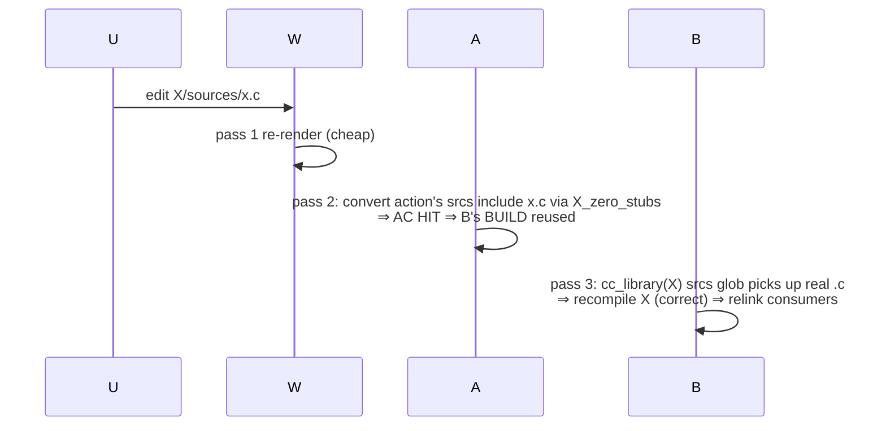
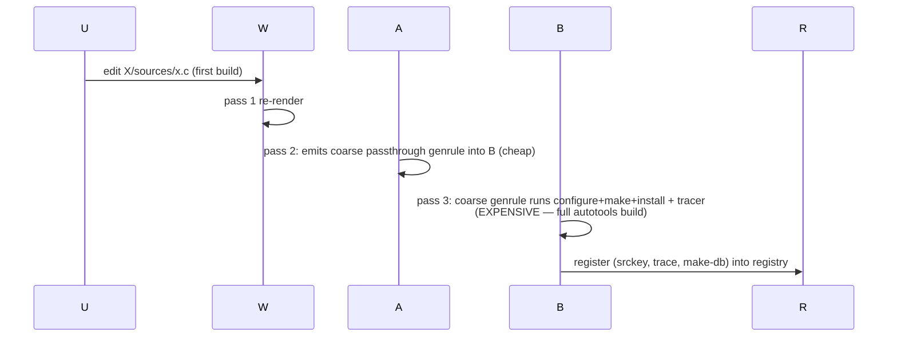
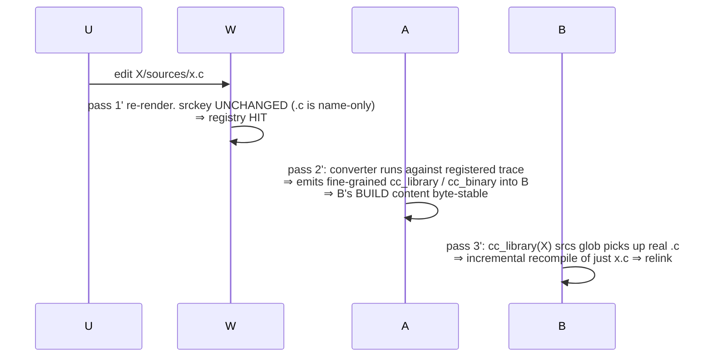
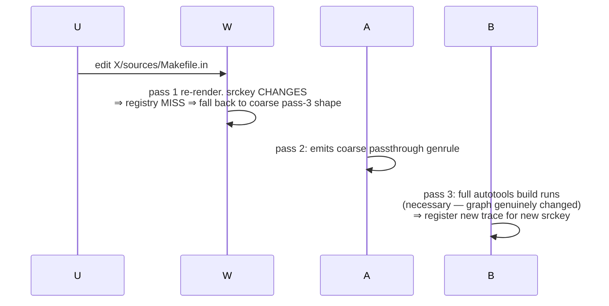

# Three-pass flow: 1 → 2 → 3 (and the 2' → 3' loop for autotools)

The cmake-to-bazel converter is a 3-pass system. Each pass has
its own caching story, and the optimization opportunities look
very different depending on which pass you're in. **Pass 3 is
where the real builds live** — pass 2 is meta-graph processing
that produces project B's BUILD definitions, and pass 1 is just
the writer that prepares project A.

For element kinds that introspect their build graph from
sources alone (cmake), pass 2 produces fine-grained BUILD
definitions in one shot. For kinds where the build graph is
only knowable by actually running the build (autotools), pass
2 emits a coarse passthrough genrule into project B, pass 3
runs the build inside it (deps available as proper B-side
targets) and registers the resulting trace, and a follow-up
**pass 2′** picks up the trace at the next render to emit the
fine-grained graph for **pass 3′** to compile natively.

## The three (or five) passes

```mermaid
flowchart LR
  bst[".bst graph"] --> wa[Pass 1: write-a<br/>renders project A]
  wa --> pa[project A]
  pa --> ba[Pass 2: bazel build A<br/>produces B's BUILD defs]
  ba --> pb[project B]
  pb --> bb[Pass 3: bazel build B<br/>real builds + artifacts]
  bb -- "cmake: done" --> art[binaries]
  bb -- "autotools: trace registered" --> reg["srckey -> trace<br/>registry"]
  reg -. "next render" .-> wa2[Pass 1': write-a<br/>render checks registry]
  wa2 --> pa2[project A']
  pa2 --> ba2[Pass 2': fine-grained<br/>BUILD defs from trace]
  ba2 --> pb2[project B']
  pb2 --> bb2[Pass 3': bazel build B'<br/>fine-grained native compile]
  bb2 --> art
```

| Pass | Cost | Cache | Inputs |
|---|---|---|---|
| 1: write-a | cheap (seconds) | none — always re-runs | .bst graph + element source bytes |
| 2: bazel build A | cheap for cmake (graph-only); cheap for autotools (just stages a passthrough genrule) | Bazel's ActionCache | per-element graph-shape |
| 3: bazel build B | per-action: cheap for cmake cc rules; **expensive for autotools coarse genrule** (configure + make + install + tracer) | Bazel's ActionCache | source bytes + dep artifacts |
| 2': write-a / bazel build A re-render | cheap | registry hit ⇒ emits fine-grained graph for B | trace registered by pass 3 |
| 3': bazel build B' | cheap (incremental, fine-grained cc) | normal Bazel | the converted cc_library / cc_binary |

**Key correction** (versus an earlier draft of this doc):
the autotools build does NOT live in pass 2 (project A's
genrule). It lives in pass 3 (project B's coarse genrule).
This matters because in pass 2 the element's dependencies
aren't materialized as Bazel targets yet — only their .bst
graph metadata is. In pass 3 the deps are real B-side
`cc_library` outputs (or coarse `install_tree.tar` filegroups
for upstream autotools elements that haven't yet round-
tripped through 2'). The build can link against them.

## Per-kind: in-2 conversion vs 3 → 2' loop

### kind:cmake — fine-grained graph from pass 2 directly

cmake exposes structured introspection (File API codemodel
+ `--trace-expand`). Pass 2's per-element action runs
`convert-element` against zero-stubbed sources (real bytes
for files cmake reads at configure time; zero stubs for
files cmake's `file(GLOB)` walks but doesn't read). Output:
fine-grained `cc_library` / `cc_binary` rules in project B's
per-element BUILD.

Pass 3 then compiles those rules natively. **One round.**

### kind:autotools — coarse-then-fine via the 3 → 2' loop

Autotools has no introspection equivalent. The only way to
recover the build graph is to run `make` and trace `execve`
calls. Two things follow:

1. The build needs deps available as proper Bazel inputs →
   it must run in **pass 3** (where deps are B-side targets),
   not pass 2 (where they're just .bst metadata).
2. The first round can't emit a fine-grained graph — only a
   coarse `genrule` that owns the entire build.

So the round-1 shape:

- **Pass 1**: write-a renders project A. No autotools-specific
  meta beyond the per-element source staging.
- **Pass 2**: bazel build A produces project B's per-element
  BUILD with a coarse genrule. The genrule's srcs include the
  element's sources + deps' install artifacts. Outputs:
  `install_tree.tar` (the actual installed files) +
  `trace.log` + `make-db.txt`.
- **Pass 3**: bazel builds the coarse genrule. configure +
  make + install run under the tracer; trace + make-db are
  byte-stable post-canonicalization. install_tree.tar
  is the artifact for downstream consumers. **trace + make-db
  are registered against the element's srckey** for the next
  round.

Round-2 shape (post-trace registration):

- **Pass 1' (write-a re-render)**: detects the registered
  trace for this element's srckey. Emits project A with a
  marker indicating "fine-graph available for X."
- **Pass 2' (bazel build A')**: per-element action no longer
  needs to defer to a coarse genrule. It reads the registered
  trace + make-db, runs the converter, and emits fine-grained
  `cc_library` / `cc_binary` BUILD definitions into project B
  (just like cmake's pass 2 does).
- **Pass 3' (bazel build B')**: native cc compile of the
  fine-grained rules. `.c` content edits trigger ONLY
  recompiling that translation unit (not the whole autotools
  build).

The registry is what carries pass-3 trace output back to
pass-2'. It's a write-a-time / pass-2-time lookup, NOT an
in-action lookup — which is why it doesn't duplicate Bazel's
ActionCache. Different layer entirely.

### When does the coarse pass-3 genrule re-run?

After round 2, the fine-grained pass-3' compilation is what
runs on most edits. The coarse pass-3 genrule only re-runs
when the registry MISSES — i.e., when the element's srckey
changes. With autotools narrowing patterns the autotools handler ships, the
srckey changes on:

- `configure` / `configure.ac` / `*.am` / `*.in` / `*.m4` /
  `*.h` content edits (graph-affecting).
- File adds/removes anywhere in the source tree (a wildcard
  rule in Makefile.in might pick them up).

The srckey does NOT change on:

- `.c` / `.cpp` / `.cc` / `.S` / `.s` content edits
  (graph-irrelevant — make's recipes stay the same).

So `.c`-only edits stay on the cheap path: 2' (registry hit)
→ 3' (incremental cc compile of the changed file).

## Scenario walkthroughs

### S1. Comment-only `.c` edit in kind:cmake element X

One round; no registry; AC narrowing via zero-stubs.

### S2. Comment-only `.c` edit in kind:autotools element X — first round

First-time cost is full build. Registry now has the trace.

### S3. Comment-only `.c` edit in kind:autotools element X — second round

Cheap. Same shape as cmake's S1 once we're past round 1.

### S4. `*.am` / `Makefile.in` / `.h` edit in kind:autotools element X

Same as S2. Cost is paid because the graph genuinely changed.

### S5. Source change in element D where consumer C build-depends on D

For both cmake and autotools, on a real D content change:

- D's pass 2/3 produces new outputs (cc rules and/or
  install_tree.tar).
- C's pass 3 has D's outputs as inputs → AC misses → C
  re-runs. For cmake, just C's affected cc_library rules.
  For autotools, C's coarse pass-3 genrule (or its
  fine-grained pass-3' equivalent if C has rounded).

For a comment-only edit in D's `.c` (round 2 for D):

- D's pass 2' produces byte-equal fine-grained graph
  (registry hit).
- D's pass 3' recompiles just the changed .c.
- C's pass 3 / 3' has D's cc_library outputs as inputs.
  Bazel's normal incremental rebuild kicks in. C may relink
  but doesn't need to recompile its own `.c` files.

This is the property the determinism work delivers
transitively.

## Where the cost actually lives

| Edit | Round 1 cost | Round 2+ cost |
|---|---|---|
| cmake .c edit | n/a | only the .c (cheap) |
| cmake .h / CMakeLists.txt edit | n/a | re-convert + re-build affected (medium) |
| autotools .c edit | full build (one-time) | only the .c (cheap) |
| autotools graph-affecting edit | full build | full build (necessary) |
| dep change | only consumer's affected actions | only consumer's affected actions |

**The full autotools build is a one-time cost per srckey.**
Subsequent edits in the .c name-only territory stay on the
cheap path forever (until a graph-affecting edit invalidates
the srckey).

## Status

This doc describes the architecture; for what's wired in
`main` today vs. what's queued, see [`ROADMAP.md`](../ROADMAP.md).
The round-2 work (trace registry, render-shape switch, post-build
trace registration) is what makes the autotools transition cheap
once an element's graph stabilizes — its fine-grained cc rules
get checked in and the genrule goes away entirely.
