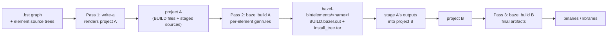
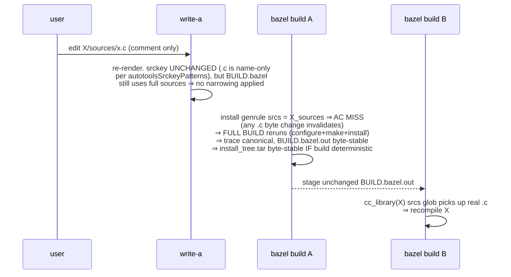
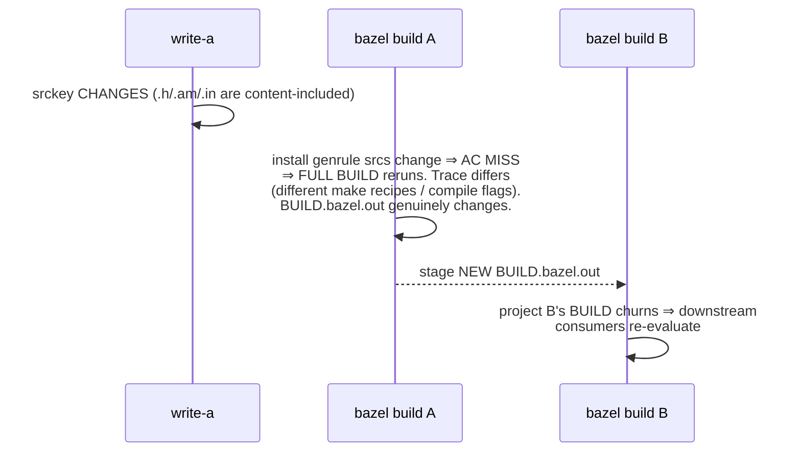

# Three-pass flow: when each phase runs and why

The cmake-to-bazel converter is a **3-pass** system. Each pass
has its own caching story, and the optimization opportunities
look very different depending on which pass you're in. This doc
exists because the tradeoffs are easy to confuse — especially
the autotools narrowing one, which is essentially impossible
under Bazel's hermetic-action model and only becomes possible
with an out-of-band side channel.

## The three passes



| Pass | Cost | Cache | Inputs |
|---|---|---|---|
| 1: write-a | cheap (seconds) | none — always re-runs | .bst graph + element source bytes |
| 2: bazel build A | varies — expensive for kind:autotools (real build); cheap for kind:cmake | Bazel's ActionCache (REAPI / buildbarn for cross-machine) | per-element genrule srcs |
| 3: bazel build B | per native cc_library / cc_binary action | Bazel's ActionCache, normal Bazel semantics | the converted cc rules + their srcs |

## Per-kind: where conversion lives

### kind:cmake — conversion is "graph-only", lives in pass 2

cmake exposes structured introspection (File API codemodel
+ `--trace-expand`). The convert action reads CMakeLists.txt
and its referenced files, but **doesn't compile anything** —
it's a pure source-graph parse.

So pass 2's per-element action narrows cleanly via the
zero-stub pattern:
- Real bytes for files cmake reads at configure time
  (`CMakeLists.txt`, `*.cmake`, `*.h` referenced by
  `target_link_libraries`, etc.).
- Zero stubs for files cmake's `file(GLOB)` walks see but
  whose content cmake doesn't read (typically `*.c` /
  `*.cpp`).

Result: `.c`-only edits don't change the convert action's
input bytes → Bazel's AC hits → `BUILD.bazel.out` reused
verbatim. Project B's BUILD doesn't churn.

### kind:autotools — conversion needs a real build, lives in pass 2 inline

Autotools has no equivalent introspection. The only way to
recover what `make` did is to **actually run it** and trace
the resulting `execve` calls. So pass 2's per-element action
is `./configure && make && make install` wrapped in
`build-tracer`, with `convert-element-autotools` parsing the
trace inline to emit `BUILD.bazel.out`.

The build is real and expensive. The trace + make-db are
byte-stable across reruns of identical builds (PR #61's
canonicalization), so `BUILD.bazel.out` comes out byte-stable
even though the build re-runs.

## Scenario walkthroughs

### S1. Comment-only `.c` edit in kind:cmake element X

```mermaid
sequenceDiagram
    participant U as user
    participant W as write-a
    participant A as bazel build A
    participant B as bazel build B
    U->>W: edit X/sources/x.c (comment only)
    W->>W: re-render (cheap; BUILD.bazel unchanged)
    A->>A: X_real glob picks up new .c bytes...<br/>BUT x.c is in X_zero_stubs ⇒ action input<br/>byte-equal ⇒ AC HIT ⇒ BUILD.bazel.out reused
    A-->>B: stage unchanged BUILD.bazel.out
    B->>B: cc_library(X) srcs glob picks up real .c<br/>⇒ recompile X (correct — content changed)<br/>⇒ relink consumers
```

Pass 2 hits the cache for the conversion. Pass 3 recompiles
X but only X (and consumers re-link, not recompile their own
sources). **Optimal for this case.**

### S2. Comment-only `.c` edit in kind:autotools element X (today)



Pass 2 re-runs the expensive build. Pass 3 still works
correctly. Project B's BUILD doesn't churn (BUILD.bazel.out
byte-stable post-#61).

**Where the cost is:** the pass-2 full build. The user wants
to avoid this for non-graph-affecting changes.

### S3. `*.am` / `Makefile.in` / `*.h` edit in kind:autotools element X



Pass 2 re-runs (necessary — the build graph genuinely
changed). Pass 3 picks up the new shape. **This is correct;
nothing to optimize.**

### S4. Source change in element D where consumer C build-depends on D

For both cmake and autotools, on a real D content change:

- D's pass 2 re-runs (D's srcs changed).
- D's `install_tree.tar` differs.
- C's pass 2 has D's `install_tree.tar` in its srcs (autotools
  dep wiring from earlier work) → C's AC misses → C re-runs.
- C's `BUILD.bazel.out` may or may not change depending on
  whether D's `.h` contents (now visible to C) shifted any
  preprocessor decisions.
- Pass 3: standard Bazel propagation.

For a comment-only edit in D's `.c`:
- D's pass 2 re-runs (same as S2).
- D's `install_tree.tar` byte-equal (deterministic ar/tar +
  byte-equal `.o`).
- C's pass 2 has byte-equal D-tar input → C's AC HITS → C
  doesn't re-run. **This works today** (with PR #61's
  determinism work).

## The optimization the user has been asking about

> can we avoid the full pass-2 build for autotools when the
> source change is non-consequential to the build graph?

For cmake the answer is "yes, already" — zero-stubs make
it work natively.

For autotools the answer is **"only with an out-of-band
side channel" (FUSE or host-fs cache).** Bazel's hermetic-
action model says: if a byte is needed at action exec time,
it's an input, and it's in the AC key. Zero-stubs work for
cmake because cmake doesn't NEED `.c` bytes at convert time.
Autotools does need them — to compile.

Concrete options:

| Option | Bazel-native? | Cross-machine via RBE? | Notes |
|---|---|---|---|
| Status quo (full sources in srcs) | ✅ | ✅ | Pass-2 always reruns on `.c` change. We have this. |
| FUSE `@src_<key>//:tree` for real bytes; zero-stubs in srcs for AC narrowing | ❌ (FUSE = side channel) | ✅ if cas-fuse runs on executor | The "fallback" path the user flagged. PR #65 is the scaffolding. |
| Host-fs source cache + `--repo_env=SRC_CACHE=...` | ❌ | ❌ (RBE has no host fs) | DOA for distributed builds. |
| 2-round write-a-time cache: register `BUILD.bazel.out` keyed by srckey; pass 1 emits a `static-files` shape on hit (no genrule) | ✅ at the BAZEL layer (BUILD that pass 1 emits is just files); side channel is at write-a layer (filesystem registry of prior conversion outputs) | ✅ if registry is shared (CAS / network FS) | This is what PR #63 + #64 were stumbling toward. Not redundant with Bazel's AC after all — operates one layer up (write-a-time, not action-time). |

The 2-round option is interesting because the **render-time
decision** moves out of Bazel entirely. write-a says "I
have a prior `BUILD.bazel.out` for this srckey; I'll
emit project A as a static-files shape that just exposes
the cached `BUILD.bazel.out` and `install_tree.tar`. No
genrule, no build needed in pass 2." Bazel's AC then
trivially hits because all outputs are filegroups over
existing files.

Risk of this approach: install_tree.tar from a prior
build with byte-different `.c` content has DIFFERENT
binaries than what the current `.c` content would
produce. So this option is correct ONLY when:
- The .c bytes are truly graph-irrelevant (we can prove
  this with srckey narrowing + ar+tar determinism).
- AND the .c bytes happen to compile to identical .o
  (only true for comment-only / formatting edits without
  `-g`).

In the FDSDK case, autotools elements typically use
`-g` → comment edits change `.o` bytes (DWARF line
table) → install_tree.tar differs. So the 2-round
"static files reuse" path is only safe under stricter
preconditions than the srckey narrowing alone provides.

## Recommendations

1. **Keep PR #61** (canonical trace + filtered make-db).
   This delivers the "BUILD.bazel.out byte-stable across
   pass-2 reruns" property, which is the foundation of
   pass-3 caching. **Independent of any narrowing work.**

2. **Keep PR #62** (per-element srckey + autotools
   narrowing patterns). srckey is useful for observability
   (debugging which paths drive build-graph identity) and
   as the input to any future narrowing work, registry-
   based or otherwise.

3. **Land PR #65 as foundation** (zero_files + filegroup
   scaffolding) but **don't flip the install genrule's
   srcs** to use it without a side channel design.

4. **Revisit narrowing if and only if pass-2 cost becomes
   painful in practice.** Concrete trigger: timing the
   FDSDK-scale runs against the dev iteration loop.
   Before that, the recommended posture is:
   - Pass-1 is cheap.
   - Pass-2 reruns on any source edit (correct under
     Bazel hermeticity).
   - Pass-2 outputs are byte-stable for graph-irrelevant
     edits (PR #61).
   - Pass-3 caches transitively via Bazel's AC.

5. **If pain shows up**, the 2-round write-a-time cache
   shape (option 4 in the table above) is the most
   Bazel-native escape hatch: side channel lives at the
   write-a layer (which is already non-Bazel), Bazel's AC
   sees only static files. Not the FUSE option.

## What this doc lets us stop arguing about

- Whether the srckey registry duplicates Bazel's AC: it
  does at the action layer, but a write-a-time variant
  does NOT — different layer entirely.
- Whether FUSE is "Bazel native": no, it's a side channel.
  But neither is the host-fs cache, and neither is the
  2-round registry. They all sidestep hermeticity.
- Whether we should pursue narrowing: only with measured
  pass-2 pain. Otherwise PR #61's determinism + native
  Bazel AC handle the common edit patterns well.
