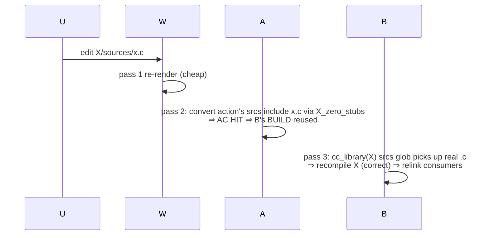
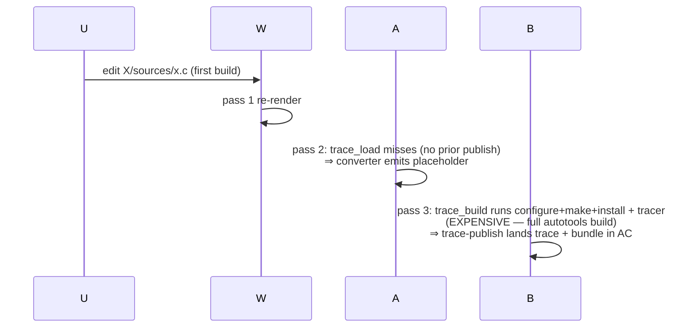
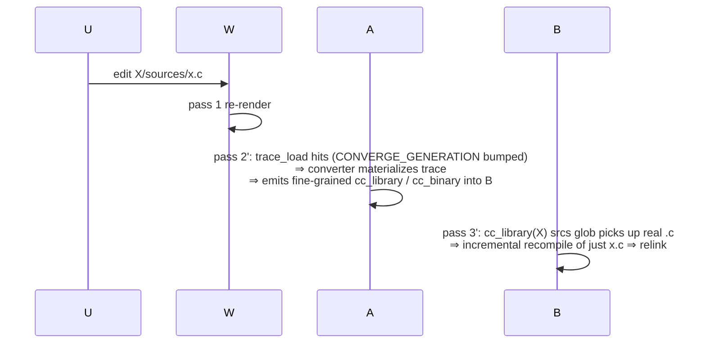
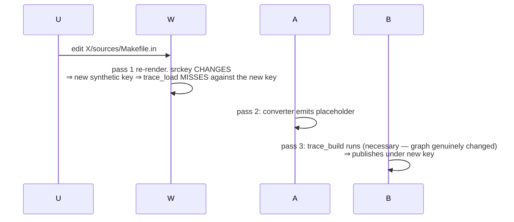

# Three-pass flow: 1 → 2 → 3 + scenario walks

This doc focuses on the **per-pass cost model** and **edit-driven
scenario walkthroughs**. For the architectural framing — two
projects, rendezvous channel, driver loop, end-state — see
[`docs/design/conversion-architecture.md`](design/conversion-architecture.md).

The buildstream-bazel converter is a 3-pass system. Each pass has
its own caching story, and the optimization opportunities look
very different depending on which pass you're in. **Pass 3 is
where the real builds live** — pass 2 is meta-graph processing
that produces project B's BUILD definitions, and pass 1 is just
the writer that prepares project A.

For element kinds that introspect their build graph from
sources alone (`kind:cmake`, `kind:meson`), pass 2 produces
fine-grained BUILD definitions in one shot. For kinds where
the build graph is only knowable by actually running the build
(`kind:autotools`, `kind:make`, `kind:makemaker`,
`kind:modulebuild`, `kind:manual`, `kind:script`), pass 2 needs
a *trace* from a previous pass 3 — the rendezvous channel
described in
[`conversion-architecture.md`](design/conversion-architecture.md).

## Pass cost table

| Pass | Cost | Cache | Inputs |
|---|---|---|---|
| 1: write-a | cheap (seconds) | none — always re-runs | .bst graph + element source bytes |
| 2: bazel build A | cheap for cmake/meson (introspection); cheap for trace-driven kinds when their `trace_load` action hits (materializes from AC) | Bazel's ActionCache (incl. action-env-tracked `CONVERGE_GENERATION` for trace_load) | per-element graph-shape + `trace_load` outputs |
| 3: bazel build B | per-action: cheap for cc rules; **expensive for trace_build genrules** (configure + make + install + tracer) | Bazel's ActionCache | source bytes + dep artifacts |

**Round 2 and beyond.** Once a trace_build action publishes its
trace + config bundle to the REAPI ActionCache, the next round's
trace_load action materializes them, the converter genrule emits
fine-grained cc rules instead of a placeholder, and pass 3 for
that element drops from the expensive trace_build path to the
cheap cc-rule compile path. The convergence driver
(`tools/converge.sh`) bumps `--action_env=CONVERGE_GENERATION`
between rounds to force trace_load re-querying; see
[`convergence-driver.md`](design/convergence-driver.md).

**Key correction** (versus an earlier draft of this doc): the
autotools build does NOT live in pass 2 (project A's genrule).
It lives in pass 3 (project B's trace_build genrule). This
matters because in pass 2 the element's dependencies aren't
materialized as Bazel targets yet — only their .bst graph
metadata is. In pass 3 the deps are real B-side `cc_library`
outputs (or coarse `install_tree.tar` filegroups for upstream
autotools elements that haven't yet round-tripped). The build
can link against them.

## Per-kind: in-2 conversion vs trace-rendezvous loop

### kind:cmake / kind:meson — fine-grained graph from pass 2 directly

cmake exposes structured introspection (File API codemodel
+ `--trace-expand`); meson exposes introspection JSON. Pass
2's per-element action runs the converter against zero-stubbed
sources (real bytes for files the build system reads at
configure time; zero stubs for files `file(GLOB)` walks but
doesn't read). Output: fine-grained `cc_library` / `cc_binary`
rules in project B's per-element BUILD. Pass 3 compiles those
natively. **One round.**

### Trace-driven kinds — coarse-then-fine via the round-2 rendezvous

`kind:autotools` / `kind:make` / `kind:makemaker` /
`kind:modulebuild` / `kind:manual` / `kind:script` have no
introspection equivalent. The only way to recover the build
graph is to run `make` (or its equivalent) and trace `execve`
calls. The shape:

- **Pass 1**: `write-a` renders both workspaces. Project A's
  per-element BUILD includes a `trace_load(...)` target — an
  action-time rule whose action shells out to `trace-lookup` and
  materializes the trace + make-db + config bundle from the AC
  if a previous round published them.
- **Pass 2**: `bazel build A` runs the trace_load actions
  (which hit or miss the AC), then the converter genrules
  consuming their outputs. On AC hit → fine-grained cc rules
  in `BUILD.bazel.out`; on AC miss → typed placeholder.
- **Pass 3**: `bazel build B` runs the `trace_build` genrule
  (tagged `trace_build` for the convergence driver's query).
  configure / make / make-install run under `build-tracer`;
  `trace-publish` lands the trace + config bundle in the AC.

Round-2 onward: the same trace_load → converter chain that
returned a placeholder in round 1 now finds the AC hit and
emits real cc rules. `tools/converge.sh` drives the fixpoint;
see [`convergence-driver.md`](design/convergence-driver.md).

### When does the coarse pass-3 genrule re-run?

After round 2, the fine-grained pass-3 compilation (the cc
rules in project B) is what runs on most edits. The
`trace_build` genrule only re-runs when the AC misses — i.e.,
when the element's srckey changes. With autotools narrowing
patterns the autotools handler ships, the srckey changes on:

- `configure` / `configure.ac` / `*.am` / `*.in` / `*.m4` /
  `*.h` content edits (graph-affecting).
- File adds/removes anywhere in the source tree (a wildcard
  rule in Makefile.in might pick them up).

The srckey does NOT change on:

- `.c` / `.cpp` / `.cc` / `.S` / `.s` content edits
  (graph-irrelevant — make's recipes stay the same).

So `.c`-only edits stay on the cheap path: trace_load hits the
AC, the converter emits the same cc rules as last round, and
pass 3 incrementally rebuilds just the changed translation
unit.

## Scenario walkthroughs

### S1. Comment-only `.c` edit in kind:cmake element X

One round; no rendezvous; AC narrowing via zero-stubs.

### S2. Comment-only `.c` edit in kind:autotools element X — first build

First-time cost is the full build. AC now has the trace.

### S3. Comment-only `.c` edit in kind:autotools element X — second round

Cheap. Same shape as cmake's S1 once we're past round 1.

### S4. `*.am` / `Makefile.in` / `.h` edit in kind:autotools element X

Same as S2. Cost is paid because the graph genuinely changed.

### S5. Source change in dep element D where consumer C build-depends on D

For both cmake and autotools, on a real D content change:

- D's pass 2/3 produces new outputs (cc rules and/or
  install_tree.tar + new bundle published under D's new srckey).
- C's pass 3 has D's outputs as inputs → AC misses → C
  re-runs. For cmake, just C's affected cc_library rules.
  For autotools, C's trace_build (or its fine-grained cc
  equivalent if C has rounded).

For a comment-only edit in D's `.c` (round 2+ for D):

- D's pass 2 produces byte-equal fine-grained graph (trace
  hit).
- D's pass 3 recompiles just the changed `.c`.
- C's pass 3 has D's cc_library outputs as inputs. Bazel's
  normal incremental rebuild kicks in. C may relink but
  doesn't need to recompile its own `.c` files.

This is the property the determinism work delivers
transitively.

## Where the cost actually lives

| Edit | Round 1 cost | Round 2+ cost |
|---|---|---|
| cmake .c edit | n/a | only the .c (cheap) |
| cmake .h / CMakeLists.txt edit | n/a | re-convert + re-build affected (medium) |
| autotools .c edit | full build (one-time) | only the .c (cheap) |
| autotools graph-affecting edit | full build | full build (necessary) |
| dep change | only consumer's affected actions | only consumer's affected actions |

**The full autotools build is a one-time cost per srckey.**
Subsequent edits in the .c name-only territory stay on the
cheap path forever (until a graph-affecting edit invalidates
the srckey).

## Status

This doc describes the per-pass cost model and scenarios; for
what's wired in `main` today vs. what's queued, see
[`ROADMAP.md`](../ROADMAP.md). For the architectural framing
(the two-project shape, rendezvous channel, fixpoint driver,
end-state via `finalize-b`) see
[`docs/design/conversion-architecture.md`](design/conversion-architecture.md).
