# Visual guide to cmake-to-bazel

A diagram-first tour of the codebase.  
For prose depth see [`docs/overview.md`](overview.md),
[`docs/three-pass-flow.md`](three-pass-flow.md), and
[`docs/build-structure.md`](build-structure.md).

---

## 1. What the tool does in one picture

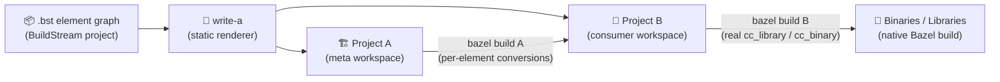

`write-a` never builds anything itself — it only writes files.
Both workspaces are then built by ordinary `bazel build //...`.

---

## 2. Repository module map

```mermaid
graph TD
    subgraph Binaries["🛠 Binaries (cmd/)"]
        WA["cmd/write-a\nStatic renderer — reads .bst graph,\nwrites project A + B"]
        CE["converter/cmd/convert-element\nkind:cmake converter\ncmake File API → cc rules"]
        BT["cmd/build-tracer\nProcess tracer\nptrace / strace wrapper"]
        CEA["cmd/convert-element-autotools\nkind:autotools converter\nTrace + make-db → cc rules"]
        SP["cmd/source-push\nPushes source content to CAS"]
        TL["cmd/trace-lookup\nLooks up cached trace from registry"]
        TP["cmd/trace-publish\nPublishes trace to registry"]
    end

    subgraph SharedLibs["📚 Shared packages (internal/)"]
        CAS["internal/cas\nLocal content-addressable store\n+ REAPI CAS interface"]
        REAPI["internal/reapi\nREAPI Action submission\n(GRPCExecutor)"]
        MANIFEST["internal/manifest\nPer-element + run-level\nJSON schemas"]
        SHADOW["internal/shadow\nShadow-tree creator\n+ trace path parser"]
        SYNTH["internal/synthprefix\nPer-element CMAKE_PREFIX_PATH\nstub tree builder"]
        TRACENORM["internal/tracenorm\nTrace canonicalization\n(pid strip, gcc temp paths)"]
        FIDELITY["internal/fidelity\nSymbol + behavioral diff\n(test gate only)"]
    end

    subgraph ConverterInternals["🔬 cmake converter internals (converter/internal/)"]
        LOWER["lower\nFile API + ninja → IR\n(the conversion brain)"]
        FILEAPI["fileapi\nParse cmake codemodel-v2\ntoolchains-v1 cmakeFiles-v1"]
        NINJA["ninja\nbuild.ninja parser\n(genrule recovery)"]
        EMIT["emit/bazel\nIR → BUILD.bazel"]
        IR["ir\nPackage / Target / Source\n/ Genrule / ImportedTarget"]
        CMAKERUN["cmakerun\nRuns cmake --trace-expand\n+ drops File API stamps"]
        HERMETIC["hermetic\nbwrap argv builder\n+ env scrubbing"]
    end

    WA --> CAS
    WA --> MANIFEST
    WA --> SHADOW
    WA --> SYNTH
    CE --> LOWER
    CE --> FILEAPI
    CE --> NINJA
    CE --> EMIT
    CE --> CMAKERUN
    CE --> HERMETIC
    CE --> SHADOW
    CE --> SYNTH
    LOWER --> IR
    CEA --> TRACENORM
    CEA --> MANIFEST
    BT --> TRACENORM
    SP --> CAS
    TL --> CAS
    TP --> CAS
```

---

## 3. Two-pass workspace generation (write-a)

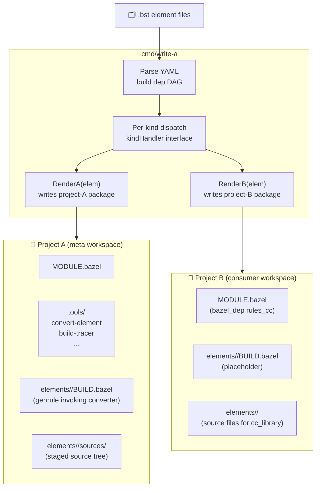

For **kind:cmake** elements: after `bazel build //...` over project A, the
driver script stages each `BUILD.bazel.out` from project A into project B,
replacing the placeholder.  For **kind:autotools** round-2, project B's
install genrule is rendered in place from the start; project A's
`BUILD.bazel.out` is consumed differently — the operator stages or builds it
as a label once the round-2 trace is available from the AC.

---

## 4. Per-kind conversion paths

### 4a. kind:cmake — single pass

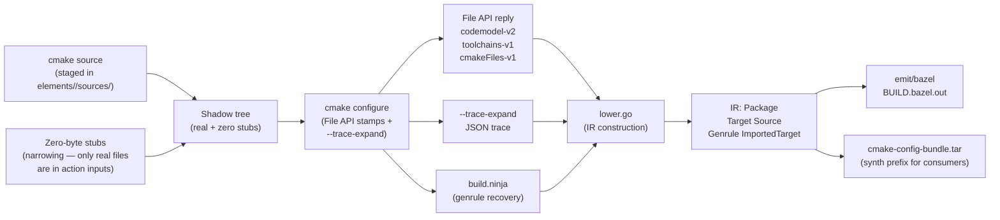

### 4b. kind:autotools — trace-driven (round 1 → round 2)

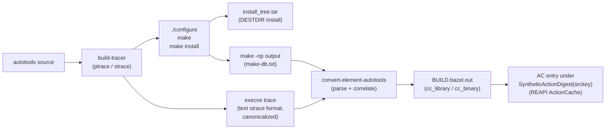

Round 2: on the next `write-a` render the registry hit means the
per-element action reads the stored trace instead of re-running
the full build — `.c`-only edits stay on the cheap path.

### 4c. Pipeline kinds (kind:make, kind:manual, kind:script, …)

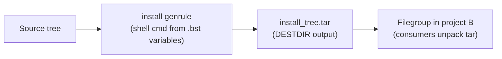

No `BUILD.bazel.out` — consumers reference the install tree directly.

### 4d. Composition kinds (kind:stack, kind:filter, kind:compose, kind:import)

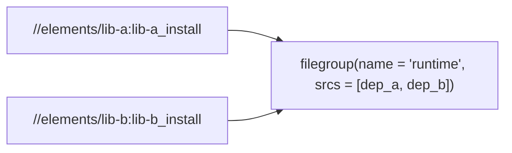

No genrule at all — just starlark filegroup composition of dep elements.

---

## 5. Cross-element data flow (cmake deps)

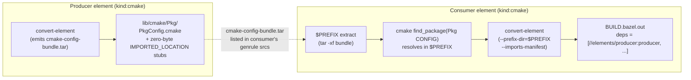

For **autotools consumers**: cross-element resolution uses `imports.json`
(`-l<name>` link flags → `//elements/<name>:<name>` Bazel labels via
`manifest.LookupLinkLibrary`).

---

## 6. The three-pass (and five-pass) build flow

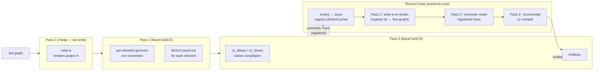

| Pass | What runs | Cache layer |
|---|---|---|
| 1 — write-a | Go binary writes files | none — always fast |
| 2 — bazel build A | per-element converter genrules | Bazel ActionCache (buildbarn) |
| 3 — bazel build B | cc_library / cc_binary compile+link | Bazel ActionCache |
| 1' — write-a (registry hit) | re-render with trace available | none |
| 2' — bazel build A' | converter reads trace, emits fine graph | Bazel ActionCache |
| 3' — bazel build B' (kind:autotools round-2) | incremental cc compile of changed .c | Bazel ActionCache |

The full autotools build (pass 3 coarse genrule) runs **once per srckey**.
After that, `.c`-only edits stay on the cheap path permanently.

---

## 7. Srckey narrowing — what triggers a cache miss

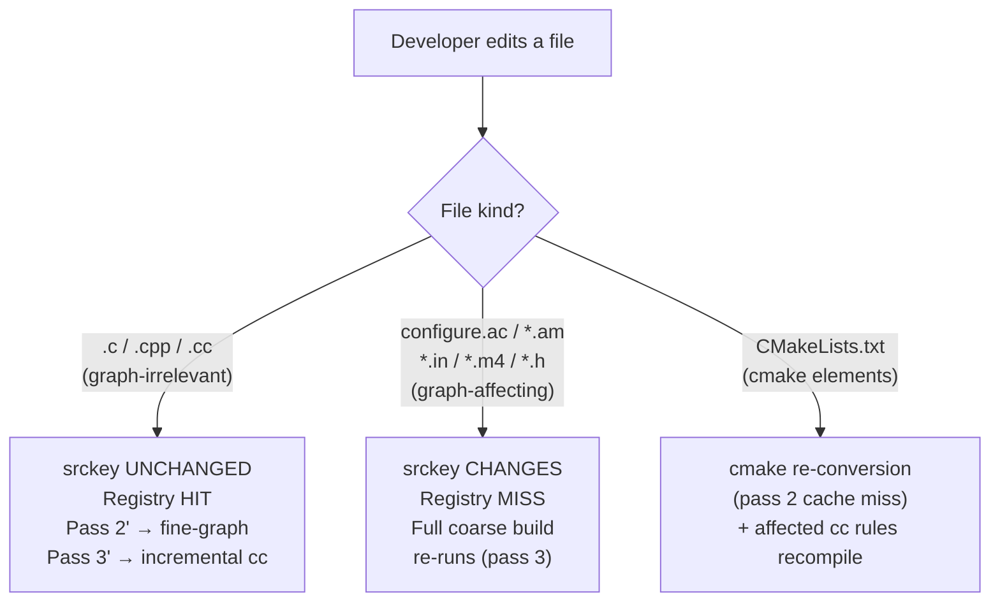

---

## 8. Caching and convergence

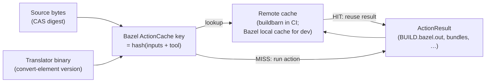

No tool-specific srckey registry for cmake — Bazel's ActionCache **is** the
convergence point. Same source + same toolchain + same converter version →
same action key → same outputs, shared across all builders automatically.

Autotools adds a separate registry layer because the coarse pass-3 genrule's
trace output needs to flow back into pass 1'/2' write-time decisions, which
happen before the ActionCache for pass 2 is consulted.

---

## 9. bb_clientd / CAS-aware source mount (optional)

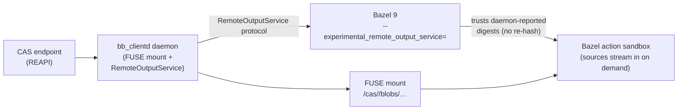

With bb_clientd, source bytes never land on the developer's disk —
actions stream them lazily through the FUSE mount. Without it, sources are
staged into `elements/<name>/sources/` on disk (the default dev path).

---

## 10. End-to-end gate map

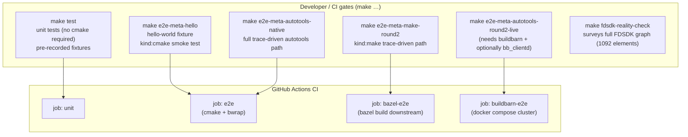

The four CI jobs shown (`unit`, `e2e`, `bazel-e2e`, `buildbarn-e2e`) are the
always-run jobs triggered on push/PR.  A fifth job, `fdsdk-probe` (FDSDK
reality-check survey), runs only on manual `workflow_dispatch` and is not
wired to any `make` target above.

---

## Further reading

| Where | What |
|---|---|
| [`README.md`](../README.md) | Quick start + repository layout |
| [`docs/overview.md`](overview.md) | Architecture in five minutes |
| [`docs/three-pass-flow.md`](three-pass-flow.md) | Detailed pass model + scenario walkthroughs |
| [`docs/build-structure.md`](build-structure.md) | Generated workspace interop contract |
| [`docs/architecture.md`](architecture.md) | Binary-level pipeline and package map |
| [`ROADMAP.md`](../ROADMAP.md) | What's shipped vs. what's next |
| [`CONTRIBUTING.md`](../CONTRIBUTING.md) | Dev-loop commands and test map |
